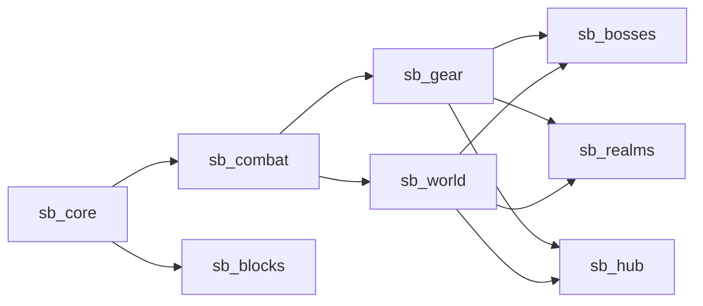

# 02 — Product Requirements: *Sealbreaker* (working title)

| | |
|---|---|
| **Status** | Draft v0.6 (Phase 2; all review questions answered; parallel research by "Astra" merged on 5 Sep 2026 and every conflict settled, see section 9.4, 9.5 and `docs/04-reconciliation.md`). **The MVP is Tier 1 complete: one boss, all five classes.** Nothing here is implemented beyond the Milestone 0 scaffold. |
| **Written** | 4 September 2026, revised 5 September 2026 |
| **Inputs** | `docs/01-research.md` (decisions: Minecraft 26.2 on NeoForge, ModDevGradle, data-first authoring) and the design answers given on 4 Sep 2026: custom "vanilla expanded" combat with believable weapon movesets (a sword's three-hit slice, a jump attack that becomes a downward thrust, a hammer's two-hit combo or a held charge) and a crit chance instead of timing bonuses; movement and dodging earned through accessories the way Terraria does it; parry deferred; accessory combining as a major system; Terraria-style world-wide Seals with per-player boss bags that hold permanent character upgrades, so late joiners re-fight bosses; magic and healer in the MVP, guns in v1.0, all built in-house; vanilla-faithful art. Combat reference the user pointed at: the Linggango modpack's telegraph and parry model. |
| **Audience** | The two developers, and future Claude Code sessions with no memory of this one. |
| **Placeholders** | By decision on 4 Sep 2026, the tier structure is fixed but every *setting, boss and unlock* is a placeholder written as `[…]`. Names of the hub, NPCs, currency, materials, realms and dungeons are likewise placeholders described by function. Appendix A keeps a non-binding scratch list of candidate names and themes; delete it if unwanted. The working title and the word "Seal" are placeholders too. |

## 1. Vision

A co-op high-fantasy Minecraft that plays like Terraria *feels*: the world is bound by six Seals, each guarded by a boss; breaking a Seal opens new places, materials, NPCs and dangers; gear is something you build, reforge and tune rather than something you find; movement and defence are earned through accessories; and fights are won by reading swings and hitboxes, not by clicking faster. It stays Minecraft underneath: mining, building, exploring and vanilla progression all still matter, and our systems layer on top of vanilla rather than replacing it. It is not a souls-like: inputs are the ones Minecraft players already know, nothing takes control away for long, and the goal is *fun to swing*, not punishing.

Target experience: 30–50 hours from spawn to the last Seal for a group of 2–4 friends on a private server, with every class viable solo.

### 1.1 Pillars

| # | Pillar | What it means in practice | What it forbids |
|---|---|---|---|
| P1 | **Vanilla, expanded** | Vanilla blocks, tools, biomes and dimensions stay relevant; our materials extend the iron → diamond → netherite ladder instead of replacing it. Inputs are click, hold, jump and sprint; systems feel like they could have shipped with the game. | Replacing vanilla mechanics wholesale; a stamina bar; lock-on; UI that looks like a different game. |
| P2 | **Seals, not grind** | Progress is gated by defeating bosses, and every boss is beatable with the previous tier's gear and movement kit plus skill. Materials for the next tier become *available*, not *cheap*, after a Seal breaks. | Gating behind hours of mining, RNG-only drops, or "kill 500 mobs" quests. |
| P3 | **Every fight has rules** | Player and monster attacks are swings with timing, arcs and hitboxes. Everything dangerous is telegraphed; if you can see it, you can dodge it. The same combat rules apply to a zombie and to the final boss. | Instant hits, undodgeable damage, HP-sponge scaling, invisible hitboxes. |
| P4 | **Your build is your class, and your kit is earned** | Five class identities (melee, ranged, magic, summoner, healer) defined by what you equip, each with a distinct party role and a solo-viable kit. Movement and dodging come from accessories found across the tiers, accessories combine into better ones, and permanent character upgrades come from each boss's personal loot bag, so the player grows in *options*, not just numbers. | Locked class selection, classes that only work in a party, gear that is strictly better with no trade-off, a full movement kit at spawn, upgrades handed out for free to late joiners. |
| P5 | **Every realm earns its visit** | Each dungeon and dimension has resources, enemies, a boss and an aesthetic you cannot get anywhere else, and a reason to return after you have beaten it. | Filler dimensions, palette-swap dungeons, resources obtainable more easily elsewhere. |

### 1.2 Terraria as a design language, not a checklist

| Terraria idea | Our Minecraft-native translation |
|---|---|
| Bosses gate progression; the world hardens after a mid-game boss | Six Seals. Breaking Seal III ("the Unsealing") hardens the overworld: enemies scale, new veins bloom, the first custom realm opens. |
| Boss summon items used under conditions | Summon items crafted from tier materials, used at a summon altar structure or inside a dungeon's sealed boss room. |
| NPCs move in when conditions are met | NPCs are *rescued*: each is held in a small structure; freeing them makes them move into the hub. |
| Goblin Tinkerer reforging | The reforge NPC: one modifier prefix per item, rerolled for coins; modifier pools per weapon archetype and class. |
| Accessories: mobility first (bottle jumps, boots, dashes, dodges), then stats | The same, deliberately: you spawn with vanilla movement only; dash, dodge roll, double jump, glide, wall-jump and air dash are accessories found tier by tier; bosses assume the kit of their tier. |
| Tinkerer's Workshop: combine accessories into better ones | Accessory combining at the reforge NPC, a major system: data-driven combine recipes turn two accessories into one that keeps both effects, so the kit keeps growing without needing more slots. |
| Life Crystals, Mana Crystals, the extra accessory slot: permanent per-character upgrades | Per-player permanent upgrades: heart shards found in the world (max health, capped), mana crystals crafted per tier (max mana, capped), and one accessory slot per boss bag. |
| Expert boss bags | Every player who fought the boss gets their own loot bag holding that boss's permanent upgrade, its kit accessory and rolled loot. Late joiners re-fight bosses for their own bags. |
| Coins and shops | A single coin item (with a pouch for bulk), dropped by enemies and paid to NPCs, reforging and key-smiths. On death you drop all carried coins where you fell (recoverable) and keep your gear; configurable. |
| Melee / ranged / magic / summon classes (+ healer from Terraria's mod scene) | Damage classes on every weapon; class armor set bonuses; class resources (mana, ammo, minion slots, healing power); a crit chance stat per class. |
| Magic mirror / recall | A recall consumable, later an accessory, that returns you to your bed or the hub. |
| Buffs, potions and potion sickness | Potions from the potions NPC; healing draughts share a cooldown so healing is a decision, not a spam. |
| Events and invasions | Optional v1.0 stretch: raids on the hub after Seal II. |

## 2. Player journey

The tier structure is fixed; settings, bosses and unlocks are placeholders to be designed later. Hours are per tier for a group of 2–3 that knows Minecraft but not our pack.

| Tier | Name | Setting | Boss | Breaking the Seal unlocks | Hours |
|---|---|---|---|---|---|
| 0 | Arrival | `[setting]` (vanilla start) | none | `[unlocks]` | 1–2 |
| 1 | `[name]` | `[setting]` | `[Boss I]` | `[unlocks]` | 3–5 |
| 2 | `[name]` | `[setting]` | `[Boss II]` | `[unlocks]` | 4–7 |
| 3 | `[name]` | `[setting]` | `[Boss III]` | `[unlocks]` + **the Unsealing** | 5–8 |
| 4 | `[name]` | Realm A `[theme]` | `[Boss IV]` | `[unlocks]` | 7–10 |
| 5 | `[name]` | Realm B `[theme]` | `[Boss V]` | `[unlocks]` | 7–10 |
| 6 | `[name]` | final arena `[setting]` | `[Boss VI]` | victory lap | 4–6 |

Total: roughly 31–48 hours.

**Tier skeleton rules** (these are the structure, not the content, and every filling must respect them):
- One boss and one Seal per tier from Tier 1; a boss is beatable with the previous tier's gear and movement kit.
- Seals are world-wide (decided): the world progresses once, for everyone. Character upgrades are per player (decided): one accessory slot at Tier 0, one more from each boss's personal loot bag (bosses I–V), six in total; heart shards and mana crystals raise the caps.
- Each tier introduces at least one movement accessory (section 3.6), at least one accessory combine recipe, and one material family with a full class spread (3.4).
- Tier 1 must make the reforge NPC available and contain one small structure, because Tier 1 is the vertical slice.
- Tier 2 must contain the first major dungeon. Tier 3 must contain the second and end with the Unsealing, which opens Realm A. Tier 4 is Realm A's boss; Tier 5 is Realm B's; Tier 6 is the final arena.
- The Nether is a tier setting (decided): Nether portal ignition is gated behind Seal II (decided as the suggested answer; revisit only if the Tier 2 design session finds a better fit).
- The vanilla Ender Dragon and Wither may gate content (decided): working assumption, the Wither gates a Tier 3–4 side material and a realm shortcut, the Ender Dragon gates a Tier 5 side Seal (an End dungeon and an accessory) that feeds the final tier. They never replace a tier boss. Not designed further until after the MVP.

**Milestone mapping** (decided 4 Sep 2026: focus on Tier 1; do not design later-tier bosses and accessories yet).
- **Vertical slice (proof of concept)** = the Tier 1 core loop with melee and bow only: one boss, one Seal, the reforge NPC, one small structure, a handful of blocks and weapons.
- **MVP = Tier 1 complete.** The same single boss, now with all five classes (magic and healer included), boss loot bags with the first permanent upgrades, heart shards, accessory combining, five NPCs, potions, and a four-player playtest. Everything beyond Tier 1 stays a placeholder until the MVP is fun.
- **Tiers 2–3** = the next milestone band after the MVP: two more bosses, the first two major dungeons, the Nether as a tier setting, the Unsealing, Realm A opened.
- **v1.0** = all seven tiers.

Scope tables in section 3 use these four columns (Slice, MVP, Tiers 2–3, v1.0) plus Later.

**Late joiners and catch-up.** Seals are world-wide, so a player who joins at Tier 3 finds the world already hardened. Their character starts at Tier 0: one accessory slot, base health and mana. They buy Tier 1–2 materials from the guide NPC at a premium and must summon and beat the earlier bosses themselves (summon items are craftable at any time) to earn their own loot bags and the permanent upgrades inside. This is deliberate: upgrades are earned per character, never inherited from the world.

---
## 3. Core systems

Each system lists its purpose, what the player sees, how it is built on Minecraft 26.2 + NeoForge, what it depends on, and its scope per milestone: **Slice** (proof of concept: Tier 1 loop, melee + bow), **MVP** (Tier 1 complete, all five classes, one boss), **Tiers 2–3** (the Unsealing band), **v1.0** (all tiers), **Later** (post-1.0). Names are placeholders described by function.

### 3.1 Seals and progression

**Purpose.** One world-level source of truth for "how far this world has come", so every other system (spawns, trades, recipes, portals, scaling) can ask a single question: *is Seal N broken?*

**Player-facing.** A Seal breaks the moment its boss dies. Everyone online sees a full-screen title and a world message; the guide NPC's journal gains a page; the hub's Seal monument lights one more ring. Nothing is silently unlocked: the journal always says what changed and where to go next.

**Implementation.**
- `SealsSavedData` (vanilla `SavedData` on the overworld, namespaced under our mod) holds the broken-Seal set, break timestamps, and the UUIDs of players present at each kill. Synced to every client on join and on change with one small payload; clients cache it for UI.
- Trigger: our boss entities call `SealService.breakSeal(seal, participants)` in their death handler. This fires a `SealBrokenEvent` on the NeoForge event bus; other mods subscribe rather than poll.
- Gates read the flag, never the boss: dimension gate activation, NPC rescue availability, enemy tier scaling, vein blooms, accessory slot count, and NPC trade sets (our merchant picks its `trade_set` by Seal count).
- **Gates are enforced where the action happens, on the server** (merged from the parallel research): a gate is a check inside the crafting, use, equip, station-open or dimension-transition code path, never only a hidden recipe, an advancement toast or a data-load condition. Data-load conditions are evaluated at load time and cannot express live world state; recipe visibility is presentation. Every gate goes through one `SealService` query so there is exactly one place to audit.
- Advancements mirror every Seal for the vanilla advancement screen; they are a *view* of the SavedData, not the source of truth.
- Commands for testing and rescue: `/seal break|restore|list`.
- Multiplayer policy (decided): Seals are **world-wide**, exactly as in Terraria; the world progresses once and late joiners find it already progressed. Rewards and character upgrades are **per player** (3.1.1 and 3.7). A config option can switch Seals to per-player; it is off by default and untested until v1.0.

**Dependencies.** Core only. Everything else depends on this.

| Scope | Slice | MVP | Tiers 2–3 | v1.0 | Later |
|---|---|---|---|---|---|
| Seals implemented | I | I | I–III | I–VI | — |
| Journal / monument UI | Chat + title only | Journal book item, monument block | Journal with map hints | Full journal | Per-player Seal mode tested |

#### 3.1.1 Character growth: boss bags and permanent upgrades (per player)

**Purpose.** Separate *world* progress (Seals) from *character* progress, so that every player earns their own power and a late joiner has a reason to fight every boss (decided 4 Sep 2026).

**Player-facing.** Every player who takes part in a boss kill receives that boss's **loot bag**, a personal item that opens into: the boss's **permanent upgrade** (bosses I–V each grant one accessory slot; the final boss's capstone perk is decided later, after the MVP), the tier's **kit accessory** (guaranteed, never rolled), and rolled loot. Opening a bag from a boss you have already claimed the upgrade from gives loot and coins only. Outside bosses, **heart shards** hidden in dungeons and deep caves raise max health, and **mana crystals** crafted from tier materials raise max mana. None of this is shared: if you were not there, you have no bag, and you summon the boss again to get one.

**Health goal** (decided: as in Terraria). Base health is 10 hearts; heart shards can take a character to **four times base** (40 hearts) by the endgame, with a cap that rises per tier. Every boss is tuned against a *tier budget*: the health and defence a player is expected to have at that tier. Mana works the same way with a smaller multiplier. The vanilla heart bar stacks rows past 10 hearts; the HUD gets a compact health display option so 40 hearts stay readable.

**Implementation.** A `CharacterProgress` data attachment on the player (persistent, `copyOnDeath`, synced): claimed upgrades per boss id, heart shards used, mana crystals used, accessory slot count. The Curios slot count reads this attachment. Loot bags are items with a `sb:boss_bag` component (boss id, encounter id, Seal count at drop time) whose loot table is chosen per boss; the upgrade entry is a conditional pool that checks the attachment. Caps, tier budgets and values are data.

**Entitlement is separate from delivery** (merged). A boss kill first records a *claim* per eligible player UUID and encounter id in the world's `SavedData`; the bag item is delivered from that claim, to the inventory if the player is online and has space, otherwise on next login. Repeated death events, reloads or a crash between kill and delivery cannot duplicate or lose a claim. Losing or trading the bag or its trophy never removes progress.

| Scope | Slice | MVP | Tiers 2–3 | v1.0 | Later |
|---|---|---|---|---|---|
| Boss bags with slot upgrade | Boss I | Boss I | Bosses I–III | all | trial-mode bags |
| Heart shards / mana crystals | shards only (Tier 1 cap) | both, Tier 1 caps | caps per tier | final caps (4× health) | — |
| Compact health display | — | yes | yes | yes | — |

### 3.2 Combat core: swings, movesets, rules

**Purpose.** Make fights about timing, spacing and reading, for players and monsters alike (P3), and make every weapon *fun to swing* (decided 4 Sep 2026). This is the pack's signature system and part of the vertical slice.

**Player-facing.**

*Swings.* Attacking starts a swing: a short wind-up, an active window in which the weapon's arc or thrust hits everything inside it once, then a recovery. Weapons have weight: a dagger lets you keep moving, a hammer plants your feet for a moment. Hits land with hit-stop, a trail, a sound and a small camera nudge (all toggleable).

*Movesets.* Every melee archetype has four moves, all on inputs Minecraft players already use. No new keys for attacking; no stamina; no lock-on.

| Input | Move | Rule of thumb |
|---|---|---|
| Tap attack | **Combo**: 2–4 swings that chain if the next tap lands inside the combo window; the last hit is the strongest | A sword's basic three-hit slice |
| Hold attack | **Charge**: hold to wind up, release for one big move; heavy weapons slow you while charging | A hammer's big charged bonk |
| Attack while airborne | **Aerial**: a plunging or diving move with extra knockback on impact | A sword's downward thrust (helm-splitter) |
| Attack while sprinting | **Sprint move**: a lunge or running strike that carries momentum | A spear's running skewer |

| Archetype | Tap combo | Hold (charge) | Aerial | Sprint |
|---|---|---|---|---|
| Sword | 3-hit slice: right slash → left slash → overhead | Wide sweep (short charge, near-180° arc) | Downward thrust: plunge that pins the first target under you | Lunging stab |
| Greatsword | 2-hit sweep: huge slow arcs | Overhead cleave: long charge, heavy damage, knock-down | Plunging slam with a small shockwave | Shoulder-charge slash that staggers |
| Spear | 3-hit: thrust, thrust, sweep | Charged lunge: dashes you forward along the thrust line | Downward pierce with extra reach | Running skewer that pierces two targets |
| Hammer | 2-hit swing combo | Big bonk: long charge, area slam, knock-up, screen shake | Ground slam: shockwave ring on landing | Shoulder bash that shoves |
| Axe | 2-hit chop | Heavy cleave that breaks a target's guard | Overhead chop, bonus against blocking targets | Running chop |
| Dagger | 4-hit fast chain | Quick stab, bonus damage from behind | Flip slash (short hop) | Dash stab that passes through |
| Bow / crossbow | vanilla draw and fire | vanilla charge *is* the hold move | no penalty for shooting airborne | — |
| Staff / focus (magic, design pass pending) | cast | charged cast | aerial cast | — |
| Healer focus (MVP) | heal arc: heals allies in the arc, damages enemies | charged group heal | — | — |

Design rules for movesets: at most four moves per archetype; no move takes control away for more than half a second; animations keep vanilla proportions; unique weapons may replace *one* move with a special (a whip's combo, a lance's charge), never add a fifth.

*Damage and crits* (decided: no timing bonuses). If a swing connects it does its listed damage, multiplied by the class attribute, with a **crit chance**: a crit deals **2× damage** with a distinct sound and a bigger hit-stop. Base crit chance is **4%** for every class and stays there; more crit comes only from crit gear, the *Lucky* reforge prefix and accessories. Crit chance is a per-class attribute (`sb:*_crit_chance`); the 2× multiplier is a config scalar.

*Weapons and tools are separate things* (decided). A weapon never mines: left click with a weapon always swings, whether or not a block is under the crosshair. A tool never uses movesets: it mines as in vanilla and does vanilla damage if it hits a mob. There is no priority rule to tune, and fighting next to a wall works.

*Earned defence and movement.* At spawn you have vanilla movement (walk, sprint, jump, swim, elytra later) and vanilla shield blocking. Dash, dodge roll, double jump, glide, wall-jump and air dash all come from accessories found tier by tier (3.6); bosses assume the kit of their tier. The only new keybind in the pack is *Dash/Dodge*, remappable, unused until you own a dash accessory.

*Parry* is **deferred** (decided: "later down the road"). The combat core keeps the hook (block-start timing is already recorded for shields), but no parry accessory or technique ships in the slice or the MVP. When it is designed, the Linggango model is the reference: a tight window with a tighter perfect frame that heals, shoves and reflects projectiles, granted by an accessory, never at spawn.

*Enemies* obey the same rules: attacks have visible wind-ups, mobs hold still while winding up, ranged mobs hold their shot, and stepping out of reach makes the attack miss. Elite and boss attacks show a brief arc preview.

**Implementation.**
- **Weapon archetypes as data** (our JSON registry `sb:weapon_archetype`): a `moves` map keyed by context (`tap` as a list of combo steps, `hold`, `air`, `sprint`), each move with hit shape (`arc`, `thrust`, `slam`, `point`), reach, arc angle, wind-up/active/recovery ticks, damage and knockback multipliers, movement (lunge vector, plunge, slow-while-charging), animation id and sounds. Every weapon item references one archetype in a data component; per-item stats (damage, attack speed, reach bonus, crit chance) come from vanilla attribute modifiers and the 1.21.11 `attack_range` component, so a new weapon is a JSON file plus a texture.
- **Input resolution.** The client sends attack press and release with context flags (airborne, sprinting). Items with an archetype component never start block breaking (the client-side mining path is skipped for them; a Mixin in core if no event covers it). The server decides: tap within the combo window → next combo step; key held past the tap threshold → charge begins, release fires it; airborne → aerial; sprinting → sprint move.
- **Server-authoritative swings.** A `SwingState` attachment on the attacker (synced) runs the move's timeline; on each active tick the server computes the hit volume from the move's shape, the look vector and reach, and applies damage once per target per swing through the vanilla damage pipeline (so enchantments, armor, damage classes and the crit roll all apply). Lunges and plunges are server-applied velocity with normal motion sync. Vanilla's click-to-hit path is disabled for archetype weapons; weapons without an archetype fall back to a default sword archetype so vanilla and third-party items still work; tools are untouched.
- **Enemy attacks** use the same `SwingState` and shapes, driven by AI goals with explicit telegraphs (animation + sound + optional arc preview) and a hold-still rule during wind-up.
- **Dash and the other kit moves** are capabilities granted by accessories: the dash accessory handles the keybind, velocity, i-frames and cooldown; roll, double jump, glide, wall-jump and air dash follow the same pattern. All data-tuned. The parry hook (block-start ticks) stays in the core for the deferred parry design.
- **Client feel** (hit-stop, trails, camera nudge, screen shake) is client-only and never waited on by the server.
- **Player animation layer.** Third person: keyframe animations per move on the vanilla player model, authored in Blockbench and played from the synced `SwingState`; either our own layer over the vanilla keyframe system (`AnimationDefinition`, the mechanism the Warden and Camel use) or PlayerAnimator, a utility library allowed under decision 0015 if it reaches 26.x; the Milestone 0 spike decides. First person: dedicated arm/item animations per move; the slice ships one polished set (sword) and reuses it for the other archetypes until MVP.
- **Hit rules** in one `combat.toml`: invulnerability frames after a hit, knockback caps, friendly fire off by default, one hit per target per swing.

**Dependencies.** Core (data registries, attachments, network). Feeds every weapon, every enemy, every boss; accessories (3.6) gate the movement kit.

| Scope | Slice | MVP | Tiers 2–3 | v1.0 | Later |
|---|---|---|---|---|---|
| Archetypes with full four-move sets | sword | sword, spear, greatsword | + hammer, axe, dagger | all melee + healer focus | datapack-authored archetypes |
| Archetypes present (partial sets reuse sword moves) | sword, spear, greatsword, bow | + staff, minion-rod, healer focus | + dagger, hammer, axe | + whip, flail, thrown, gun | — |
| Crit chance | yes | 4% base, crit gear and *Lucky* | tuned | tuned | — |
| Parry | — | — | — | — (deferred by decision) | designed and built here at the earliest |
| Enemy swings | 3 enemies + Boss I | all Tier 1 enemies | all | all | — |
| First-person animation | one full set | sword set reused | per archetype | polished | — |

### 3.3 Classes and resources

**Purpose.** Give every player a distinct way to fight and a distinct job in a party, without locking anyone in (P4).

**Player-facing.** Your class is whatever your weapon and armor say it is. Every weapon has a **damage class**; every class armor set has a **set bonus** that only pays off if you fight with that class; accessories lean one way or another. Switching is as easy as switching gear. Movement accessories are class-agnostic.

| Class | Role in a party | Solo identity | Resource | Signature |
|---|---|---|---|---|
| Melee | Frontline: highest defence, holds aggro, best knockback | Sturdy, short reach, wants to be in the arc | None (cooldowns) | Combos, charges, the highest base crit; "hold the line" set bonuses |
| Ranged | Sustained single-target damage from distance | Kiting; ammo management matters | Ammo (arrows, bolts, throwing knives; bullets in v1.0) | Charge shots, special ammo crafted per tier |
| Magic | Burst and area damage, utility (slows, pulls, wards) | Powerful but mana-limited; must plan | Mana (a regenerating attribute-backed pool) | Spells as items with cast times; design pass pending (3.15) |
| Summoner | Attrition and multi-target; frees the player to move | Weakest armor, strongest positioning freedom | Minion slots (attribute), whip-style "command" attacks | Minions target what the summoner hits |
| Healer | Sustain and buffs for the party | Solo viability through self-heal-on-hit and durable buffs | Healing power (attribute) and a shared heal cooldown | Heals as swings: an arc that heals allies and damages foes |

**Implementation.**
- **Damage classes** are a small JSON registry (`sb:damage_class`); each weapon's component names one; armor set bonuses and accessories apply attribute modifiers scoped to a class (our attributes: `sb:melee_damage`, `sb:ranged_damage`, `sb:magic_damage`, `sb:summon_damage`, `sb:healing_power`, one `sb:*_crit_chance` per class, plus `sb:max_mana`, `sb:mana_regen`, `sb:minion_slots`). The damage pipeline multiplies by the class attribute and rolls the class crit in an incoming-damage hook.
- **Set bonuses** are data: `sb:armor_set` lists the pieces and the bonus (attribute modifiers plus an optional scripted effect id).
- **Resources** are attributes on the player plus a synced attachment for current mana and heal cooldown; the HUD shows only the resource of the class you are wielding.
- Classes never restrict equipping anything; they only change what is *effective*.

**Dependencies.** Combat core; accessories; HUD.

| Scope | Slice | MVP | Tiers 2–3 | v1.0 | Later |
|---|---|---|---|---|---|
| Classes present | Melee, Ranged (bow) | **all five** (decided): + Summoner, Magic v1, Healer v1 | all five, second pass | all five, tuned | Bard/rogue-style extras |
| Set bonuses | 1 (melee) | 1 per class | 1 per class per tier | 2 per class | — |

### 3.4 Weapons, armor and material tiers

**Purpose.** Large weapon variety (decided) with cheap authoring: most of a weapon is data.

**Player-facing.** Each tier adds a material family with a full class spread, plus unique boss and dungeon weapons with a special move or mechanic. Weapons show their archetype, damage class and reforge prefix in the tooltip, with a rarity colour and icon.

**Implementation.**
- Standard weapons: one JSON item definition (archetype, damage class, attributes, rarity, tier data map entry) + item model definition + texture; generated by datagen from a small table. Uniques add a Java behaviour class (on-hit effects, projectiles, a replaced move) or, where possible, a data-driven enchantment-style effect with `run_function` hooks.
- Material tiers extend vanilla: iron (Tier 0–1), `[Tier 1 material]`, `[Tier 2 material]` alongside diamond, `[Tier 3 material]` alongside netherite, then `[Tier 4–6 materials]`. Our tiers are made by combining the vanilla material with a boss essence, so vanilla mining stays relevant (P1).
- Armor: vanilla `equippable` + `equipment/` assets; class sets per tier from Tier 1.
- Vanilla weapons keep working through the default archetype fallback.

**Dependencies.** Combat core, classes, rarity (3.12), reforging (3.5).

| Scope | Slice | MVP | Tiers 2–3 | v1.0 | Later |
|---|---|---|---|---|---|
| Weapons | 8 (melee + bow, 2 uniques) | ~25 (Tier 1 across five classes, 4 uniques) | ~50 | ~100 | ongoing |
| Armor sets | 1 | 5 (one per class) | 9 | 14 | — |
| Unique mechanics | 2 | 4 | 10 | 25 | — |

### 3.5 Reforging: the reforge NPC

**Purpose.** Make gear a project (P4): a cheap, repeatable way to tune a weapon or accessory, and the pack's main coin sink.

**Player-facing.** Once rescued, the reforge NPC stands in the hub. Right-click opens the Reforge screen: put in a weapon, armor piece or accessory; the coin cost is shown (scales with tier and rarity); press Reforge to roll a new prefix such as *Lucky* (+crit), *Heavy* (+damage, −speed), *Swift* (+speed), *Broad* (+arc size), *Balanced*. Prefixes are one per item, always visible in the name, and never destroy the item. Some prefixes are only in the pool for certain archetypes or classes (a spear cannot roll *Broad*; a minion rod cannot roll *Lucky*). Later, the NPC lets you *lock* a prefix for a large fee.

**Implementation.**
- `sb:reforge_modifier` JSON registry: id, display name, rarity weight, allowed archetypes/classes, attribute modifiers, and up to one special stat (arc size, charge time, projectile speed, mana cost, minion count). `sb:reforge_pool` groups modifiers per archetype/class.
- Applying a modifier writes our `sb:reforge` data component (modifier id) and rewrites the vanilla `attribute_modifiers` component with a namespaced modifier id so it is replaced cleanly on the next roll. Item model definitions can react to the component (a subtle glint tier) and the tooltip provider adds the prefix line.
- The reforge NPC is an NPC entity (3.10) whose interaction opens a `MenuType` with two tabs: Reforge (one slot and a result preview) and Combine (two accessory slots, a catalyst slot, an output preview; see 3.6); the server rolls (seeded, weighted) or resolves the combine recipe and charges coins from the player's inventory.
- Costs: base cost per tier × rarity multiplier; a *no-repeat* rule prevents rolling the same prefix twice in a row.
- **Reforging is a server transaction** (merged): the client only requests; the server validates the open menu, the item, its eligibility, interaction range and the exact cost, then debits and rewrites the item in one step and rejects stale or duplicate requests (simultaneous clicks, shift-clicks, a full inventory, a disconnect mid-operation, a restart). Never trust stat values from the client. Save/restart behaviour is tested explicitly.
- **Onboarding rule** (merged): a player's first reforge is a guaranteed, affordable improvement, so the service is learned as "this makes my weapon better" before it becomes a gamble.
- **Open design option for the MVP**: the parallel research proposed a *keep-or-accept* flow (pay to generate one alternative prefix, then keep the current one or accept the offer; the pending offer persists across closing the screen or disconnecting). It is gentler than Terraria's blind reroll; decide at the Tier 1 design session which flow ships.

**Dependencies.** NPCs (3.10), economy (3.12), weapons (3.4), accessories (3.6).

| Scope | Slice | MVP | Tiers 2–3 | v1.0 | Later |
|---|---|---|---|---|---|
| Modifiers | 12 (melee + bow) | 20 (all classes, incl. *Lucky*) | 30 | 50 | community pools |
| Lock a prefix | — | — | — | yes | — |
| Reforge armor/accessories | weapons only | all | all | all | — |

### 3.6 Accessories: the earned kit and combining

**Purpose.** Horizontal power, build identity, the way the player *earns* movement (decided), and, through combining, the pack's long-term crafting hobby (decided: "a big part of it").

**Player-facing.** Six accessory slots: one at spawn, one from each boss's loot bag (3.1.1). Accessories come in two families. **Kit accessories** add an option you did not have: a dash, a dodge roll, a double jump, a glide, a wall-jump, an air dash. **Stat accessories** lean a build toward a class or a situation: crit, mana regen, minion slots, ally healing, hazard resistance. Every tier introduces at least one kit accessory, and every boss is designed around the kit its tier provides, so the game stays fair and gets faster as you grow. Accessories can be reforged.

**Combining.** At the reforge NPC, two accessories plus a tier material become one accessory that keeps both effects (Terraria's workshop idea, treated here as a core system). Combine recipes form trees whose depth depends on the accessory (decided): a dash and a double jump become an air-mobility charm; sure-footing and a glide become a landing charm; several class stat trinkets become a class emblem; and at the top of the tree sits at least one **super accessory that needs nearly everything** (Terraria's Cell Phone idea), planned later. Combined accessories can be combined again up the tree, so a late-game player carries six deep accessories rather than six shallow ones, and slot pressure is the main reason to keep crafting. Combined accessories keep a reforge prefix and can be reforged.

**Tier 1 kit (the MVP's concern).** Sure-footing (reduced fall damage) from the Tier 1 structure or shop; a first **dash** (short burst, cooldown) guaranteed in `[Boss I]`'s loot bag; Tier 1 class trinkets (one per class); and the first combine recipes: dash + sure-footing → a safe-dash charm, two class trinkets → a class emblem. `[Boss I]` is designed around walk, sprint, jump, shield and dash.

**Later tiers (sketch only, by decision not designed until after the MVP).** Dodge roll (Tier 2), double jump (Tier 3), glide and wall-jump (Tier 4), air dash (Tier 5), a capstone from the final bag; each tier's boss assumes the kit up to that tier. Revisited tier by tier.

**Implementation.** Curios (NeoForge, LGPL) provides the slots, UI and sync; slot types are our JSON and the slot count reads the `CharacterProgress` attachment. Stat accessories are attribute modifiers where possible. Kit accessories implement a small `Accessory` interface that grants a *capability flag* (`sb:dash`, `sb:roll`, `sb:double_jump`, …) read by the combat core and the movement handler; the flag, cooldowns and tuning values are data. Only one kit capability of each kind is active at a time (two dash accessories do not stack; the better one wins). Combining is a data registry (`sb:accessory_combine`: inputs, catalyst, output, tier) applied through a second tab of the reforge NPC's menu; a combined accessory is its own item whose effects list is the union of its parts, so no runtime "contains" logic is needed. If Curios ever lags a version bump, the interface is narrow enough to swap to our own attachment-backed container (decision point at MVP).

**Dependencies.** Classes, combat core, reforging, character growth (3.1.1).

| Scope | Slice | MVP | Tiers 2–3 | v1.0 | Later |
|---|---|---|---|---|---|
| Accessories | 5 (sure-footing, dash, 3 stat) | 12 (Tier 1 kit + five class trinkets + utility) | 24 | 50 (full kit, emblems, the super accessory) | ongoing |
| Combine recipes | 1 (prove the system) | 4 | 10 | 25+ | community recipes |
| Slots | 2 | 2 | 4 | 6 | — |

### 3.7 Bosses

**Purpose.** The pack's milestones, tests of P3, and the Seal triggers.

**Player-facing.** Bosses are summoned deliberately (a summon item at a summon altar, or by entering a sealed boss room), fight inside a visible arena, have a boss bar with phase markers, telegraph everything, and drop a personal **loot bag** for *every* participant (3.1.1). Losing resets the fight; the boss despawns when the arena is empty. Bosses can always be summoned again (a summon item costs tier materials), because late joiners and returning players need their own bags; a v1.0 "trial" mode adds modifiers for better rewards. Each boss is designed for the movement kit and the health/defence budget of its tier: `[Boss I]` is beatable with dash alone at Tier 1 health. Bosses beyond Tier 1 are not designed until the MVP is fun (decided).

**Implementation.**
- **Boss framework** (`sb_bosses`): a `BossEntity` base with a data-driven *phase machine* (phases, HP thresholds, per-phase attack sets and cadence, adds), `ServerBossEvent` bar, arena bounds that pull stragglers back and despawn the boss if no players remain, and a participant roster used for loot bags.
- **Roster and credit policy** (merged from the parallel research, replacing the earlier "dealt damage or stood in the arena for 20 seconds" rule): players opt in at the altar before the fight and see the same roster; the roster is recorded at the start of the attempt. Players may join later to help, but bag eligibility starts with the next attempt. A rostered player who stays in the arena qualifies; dying during the attempt keeps eligibility; there is no damage quota, so a support player qualifies. A disconnected rostered player keeps eligibility for a 60-second grace window, and a qualifying completion is persisted to their UUID even if they are offline when it happens. Scaling (boss health and add counts, never damage per hit) is locked to the roster at the start so disconnects cannot manipulate it; a full wipe resets the attempt. A server restart cancels an unfinished encounter safely: completed claims are kept, owned hazards are cleared, and a retry costs no rare material.
- **Each boss teaches one decision** (merged): a boss is designed around one lesson (read a wind-up and punish the recovery; pick a safe lane; bait a charge; manage targets while moving) and must be beatable solo with the previous tier's gear and kit. No unavoidable damage, no long invulnerability phases, no difficulty by health inflation alone.
- **Summon items are craftable from resources available before the boss's own gate**, so a gate can never depend on what it unlocks and a creative-only recovery is never the only route.
- Attacks are `SwingState`s from the combat core plus projectiles and area effects; every attack declares wind-up, telegraph (animation + sound + optional arc preview), active frames and recovery in JSON, so tuning is data. Each boss lists the kit capabilities it assumes, and its design review checks that every attack is avoidable with exactly that kit.
- Models and animations through GeckoLib; animation triggers are server events synced via entity data so all clients play the same thing.
- Loot bags: a per-player container item with a loot table per boss and per Seal count; the boss's permanent upgrade (once per player, checked against `CharacterProgress`), the tier's kit accessory and a trophy are guaranteed, the rest is rolled.
- Difficulty scales with participant count (HP and adds, never damage per hit).

**Dependencies.** Combat core, accessories, Seals, loot, dungeons (for room bosses), animation library.

| Scope | Slice | MVP | Tiers 2–3 | v1.0 | Later |
|---|---|---|---|---|---|
| Bosses | 1 | 1 (same boss, polished; loot bags; tuned for all five classes) | 3 | 6 (+2 optional mini-bosses) | Trial modifiers, extra bosses |
| Phase machine | 2 phases | 2 | 2–3 | 3–4 | — |

### 3.8 Dungeons

**Purpose.** Hand-crafted places with rules: keys, locked doors, sealed boss rooms, and loot you cannot get elsewhere (P5).

**Player-facing.** Tiers 2–5 each have one major dungeon in their setting (`[Dungeon II–V]`), plus minor structures: the Tier 1 structure where the reforge NPC is held, summon altars, NPC cells, shrines. Major dungeons have a locked inner door that needs a key from a mini-boss or a hidden cache, a boss room that seals when you enter, trap rooms that use the combat rules (swinging blades you dash or roll through), and hidden heart shards (3.1.1). Dungeons are marked on the guide NPC's maps.

**Implementation.**
- Hand-built rooms as structure templates (structure blocks / Axiom), assembled by vanilla jigsaw with template pools and processor lists; one structure per dungeon within the 256×256 footprint limit (multi-structure dungeons are Later). Structure sets control rarity and spacing; biome tags tie dungeons to settings.
- Java blocks: locked door (consumes a key item with a matching tag), key pedestal, boss-room seal block (closes when a player enters, opens on boss death or wipe), dungeon spawner (tier-aware, despawns when cleared), trap blocks that fire `SwingState`s.
- Loot: tier-gated loot tables with a guaranteed unique per dungeon (first clear) and a repeatable pool; chests are per player, as vanilla trial vaults are, so groups do not fight over them. Nothing a player *needs* for progression comes from a chest; required items come from the boss bag, so a previously looted dungeon stays a valid catch-up route.
- **Discovery guarantee** (merged): before a dungeon becomes a required gate, its placement is validated across a documented seed suite within a bounded search radius, the guide NPC's map can never point at a structure that does not exist, and a safe fallback (a second placement pass or a craftable locator) exists. A new structure never generates retroactively in explored chunks, so adding a required dungeon to an existing world needs an explicit access plan.
- **Building is preserved** (merged): outside an active encounter, ordinary mining and building are untouched; during a fight only the minimal arena mechanisms (altar, seal blocks, key pedestal) are protected; the structure is never restored over player builds after a clear; a broken altar has a documented, in-survival recovery route.
- Runtime-procedural layouts are explicitly out of scope for v1.0.

**Dependencies.** Worldgen, combat core, Seals, loot, bosses.

| Scope | Slice | MVP | Tiers 2–3 | v1.0 | Later |
|---|---|---|---|---|---|
| Major dungeons | 0 | 0 (the Tier 1 structure grows into a small dungeon with a locked door and heart shards) | 2 | 4 | more per setting |
| Minor structures | 2 (Tier 1 structure, summon altar) | 3 (+ NPC cells) | 5 | 10 | — |
| Keys/locks | prototype door | first key + door | full | full | — |

### 3.9 Dimensions

**Purpose.** Two realms that change the rules (P5), each opened by a Seal. Themes are placeholders.

| | Realm A (Tier 4) | Realm B (Tier 5) |
|---|---|---|
| Theme | `[theme]` | `[theme]` |
| Entry | A gate structure in the overworld, activated with a Tier 3 item after the Unsealing | A gate structure in the overworld, activated with a Realm A item after Seal IV |
| Hazards | `[hazards]`; at least one hazard countered by a Tier 3 kit accessory | `[hazards]`; at least one hazard countered by a Tier 5 kit accessory; a traversal hazard that the air kit (double jump, glide, air dash) turns into fun |
| Unique resources | `[Tier 4 material]` ore, one block family, one flora set | `[Tier 5 material]` ore, one block family, one flora set |
| Return path | The gate is two-way; the recall item works | A fall or exit hazard returns you to the overworld with damage, not death; the recall item works |
| Time | Own world clock (26.1) | Own world clock with a hazard timeline |

**Implementation.** JSON dimension + dimension type + noise settings + density functions + biomes + placed features, prototyped in Misode's generators, then owned by datagen. Environment attributes and world clocks (26.1) handle light, fog, time and hazard timelines. Java: gate blocks using the vanilla `Portal` interface and teleport transitions, dimension special effects (sky, fog colour) via the NeoForge client event, and any realm-specific status effect.

**Travel rules** (merged): a gate check runs on the *travelling* player at the actual transition, including mounts and passengers, so nobody bypasses a gate by following a friend; a denied player stays safe on the source side with a one-line reason; **return travel is always allowed**, and a lost or revoked flag can never strand a player in a realm or the Nether.

**Dependencies.** Seals, worldgen, enemies, dungeons, accessories.

| Scope | Slice | MVP | Tiers 2–3 | v1.0 | Later |
|---|---|---|---|---|---|
| Dimensions | 0 | 0 | Realm A opened (terrain, resources, enemies) | both complete with dungeon and boss | a third realm |

### 3.10 The hub and NPCs

**Purpose.** A home base that grows as Seals break, and the faces of the pack's systems (reforging, potions, maps, shops).

**Player-facing.** The hub is a small structure near spawn with the guide NPC already home. Each rescued NPC claims a room; the housing NPC (Tier 4) lets you upgrade the hub and move NPCs into rooms you built (a bed plus a claimed door, like villager housing but explicit). NPCs sell and buy, give hints, and each has one *service*. Roles: **guide** (journal, structure maps, catch-up materials), **reforge** (reforging), **merchant** (general goods, buys loot), **potions**, **guns** (v1.0), **magic** (v1.0), **housing** (v1.0), and optional **beasts** (mounts/summons) and **fishing**.

**Implementation.** One NPC entity type with data-driven *roles*: 26.1 `villager_trade`/`trade_set` for shops, selected by Seal count; dialogs (1.21.6) for hints and the journal; a `MenuType` only where item slots are needed (reforging, later gun/spell crafting, accessory combining). NPCs are invulnerable by default, teleport home if lost, and are rescued by breaking a chained cell block in their structure (which unlocks after the relevant Seal). Housing is a claimed-room rule, not a villager-style simulation. **Recovery rule** (merged): a service NPC can never permanently lock progress; if one is missing (void, unloaded chunk, a bug) it respawns at its hub room on the next server start, and the guide NPC has a dialog option to recall any rescued NPC. One shared NPC serves several players through separate menu sessions.

**Dependencies.** Seals, economy, reforging, structures.

| Scope | Slice | MVP | Tiers 2–3 | v1.0 | Later |
|---|---|---|---|---|---|
| NPCs | guide, reforge | + merchant, potions, magic | same five | + guns, housing | beasts, fishing |
| Housing | hub rooms only | hub rooms | hub rooms | player-built rooms | schedules |

### 3.11 Blocks and building materials

**Purpose.** Give each setting a look and give builders something new every tier (P1, P5), at low engineering cost.

**Player-facing.** Every tier adds at least one full decorative family (a planks-style set of ~14 blocks, or bricks and pillars for stone families) and a handful of functional blocks.

| Tier | Decorative families (≈14 blocks each) | Functional blocks |
|---|---|---|
| 0–1 | `[wood family A]`, `[stone family A]` | summon altar, hub banner, Tier 1 material block, trophy stands |
| 2 | `[Dungeon II family]` | locked door, key pedestal, boss seal block, dungeon spawner |
| 3 | `[Dungeon III family]` | Realm A gate frame, Tier 3 material block |
| 4 | `[Realm A wood family]`, `[Realm A stone family]` | Realm B gate frame, Realm A light source, Tier 4 material block |
| 5 | `[Realm B family]`, `[Realm B glass/crystal]` | Tier 5 material block |
| 6 | `[final family]` | Seal monument, rematch altar |

**Implementation.** A `BlockFamily` helper registers a whole family from one call and datagen emits blockstates, models, loot, recipes and tags. Functional blocks are individual Java classes. Rough counts: 8 families ≈ 115 blocks, ~40 functional, ~30 ores/misc → ~185 at v1.0, plus ~100 more if optional families are built later.

**Dependencies.** Datagen only; dungeons and dimensions consume them.

| Scope | Slice | MVP | Tiers 2–3 | v1.0 | Later |
|---|---|---|---|---|---|
| Blocks | ~25 (one family + altar + a few) | ~50 (two Tier 1 families + functional) | ~120 | ~200 | ~300 |

### 3.12 Loot, rarity and economy

**Purpose.** Make finding things exciting and spending things meaningful.

**Player-facing.** Six rarities, each with a colour and an icon (never colour alone): Common, Uncommon, Rare, Epic, Legendary, Mythic. Rarity affects reforge cost and drop weight, not raw power; a Rare weapon is a good weapon of its tier, a Mythic one has a unique move or mechanic. Coins drop from enemies (more per tier), come from selling loot to the merchant, and are spent on reforging, combining, potions, keys and maps. Boss loot bags are per player. **Death** (decided): you drop *all* carried coins where you fell as an ordinary pickup that anyone can collect, and you keep your gear; both halves are config options (`deathCoinDropFraction`, `keepGearOnDeath`).

**Implementation.** Rarity is our `sb:rarity` component plus the vanilla `rarity` for name colour; a data map tags every item with tier and rarity so loot tables, reforge costs and the merchant's buy prices read one source. Loot: vanilla loot tables with `random_sequence`, tier-gated pools via our Seal predicate (a custom loot condition), `set_components` for pre-rolled reforge prefixes on drops. Coins are an item (plus a pouch that holds 64×64) so vanilla containers, hoppers and trades work with them; no scoreboard currency. Death handling hooks the drops event: coins (and pouches) are dropped as a normal item entity, everything else is kept.

**Dependencies.** Seals, weapons, reforging.

| Scope | Slice | MVP | Tiers 2–3 | v1.0 | Later |
|---|---|---|---|---|---|
| Rarities | 4 shown | 6 | 6 | 6 | — |
| Currency | coin | + pouch, merchant buy-back | same | same | banking |

### 3.13 Enemies and scaling

**Purpose.** Enemies that teach the combat rules and make each setting feel different, with scaling that stays honest (P3).

**Player-facing.** Each tier adds 3–6 enemies with distinct roles: a rusher, a ranged harasser, a tank with a big slow swing, a caster or summoner type, and an *elite* variant that appears after the tier's Seal breaks. Enemies teach the kit: Tier 1 enemies have wide slow swings you dash out of; Tier 2 adds multi-hit attacks worth rolling through; Tier 3 adds ground hazards you double-jump over. After the Unsealing, overworld enemies scale (more HP and more adds, never one-shot damage) and elites roam at night.

**Implementation.** Custom entities with goal-based AI whose attacks are `SwingState`s with telegraphs and hold-still wind-ups; models via GeckoLib or vanilla keyframes for simple ones. Spawns: NeoForge biome modifiers per biome/dimension; Seal gating and scaling in a `FinalizeSpawnEvent` handler that applies attribute modifiers by Seal count and cancels not-yet-unlocked tiers. Elite affixes are data (a small pool: armoured, swift, venomous, warded).

**Dependencies.** Combat core, Seals, dimensions.

| Scope | Slice | MVP | Tiers 2–3 | v1.0 | Later |
|---|---|---|---|---|---|
| Enemies | 3 | 6 (the Tier 1 roster) | 12 | 30 | ongoing |
| Elite affixes | 0 | 2 | 4 | 8 | — |

### 3.14 Potions and buffs

**Purpose.** Preparation as a skill, and the potions NPC's reason to exist.

**Player-facing.** Potions extend vanilla brewing: class buffs (melee damage, ranged crit, mana regen, minion damage, healing power), utility (realm sight, hazard wards, wall-climb), and healing draughts that share one *salve cooldown* (30 s) so healing is a decision. Buffs are visible on the HUD with timers.

**Implementation.** New `MobEffect`s in Java; potions of existing effects and brewing recipes are data; the salve cooldown is a synced attachment consulted by all healing consumables (and by healer-class heals with a separate, shorter cooldown).

**Dependencies.** Classes, NPCs.

| Scope | Slice | MVP | Tiers 2–3 | v1.0 | Later |
|---|---|---|---|---|---|
| Potions | 0 | 6 (one class buff each + healing draught) | 10 | 25 | — |

### 3.15 Magic (design pass pending; not in the proof of concept)

**Decision (4 Sep 2026).** Magic is a core class, built in-house, with existing mods as reference only, and it needs its own design pass because Minecraft magic mods tend to be either dominant or useless. It is not in the vertical slice but **it is in the MVP** (decided), so the design pass (`docs/design/magic.md`) is a Milestone 2 deliverable that must land before magic implementation starts in Milestone 3. This section reserves the design space so the core never needs a rewrite.

**Reserved in the core now:** the `magic` damage class; `sb:max_mana` and `sb:mana_regen` attributes with a synced current-mana attachment and HUD element; a `SpellItem` base that uses the combat core's move timing (tap / hold / aerial casts) and the shared projectile base for bolts; a `sb:spell` JSON registry placeholder; the magic NPC role.

**Design constraints to carry into the pass:** mana is the balancing lever (burst is allowed, sustained dominance is not); every spell has a wind-up that enemies can interrupt; spells scale with tier gear, not with player level; at least one spell per school is useful for utility (light, movement, wards) so mages have a job when not dealing damage; spell acquisition is gated by Seals and dungeons like every other weapon.

**Scope.** Slice: none. MVP: a v1 magic class with 6–8 Tier 1 spells across two schools, one armor set, mana crystals and the magic NPC. Tiers 2–3: +4 spells per tier. v1.0: ~15 spells, 2 armor sets, tuned.

**Healer (decided: also in the MVP).** The healer class is small enough to share the magic design pass: it uses the healing-power attribute, the shared heal cooldown, a healer focus archetype (heal arc, charged group heal) and 3–4 support abilities (heal-over-time, a ward, a cleanse, a damage buff). MVP: a v1 healer with one focus, one armor set and the four abilities; v1.0: tuned, with two focuses and two sets.

### 3.16 Guns (design pass pending; not in the proof of concept)

**Decision (4 Sep 2026).** Guns are a ranged sub-class, built in-house, deferred past the vertical slice, with a dedicated design pass (`docs/design/guns.md`, Phase 4).

**Reserved in the core now:** ammo as items with a `sb:ammo` component (consumed with a per-tier chance to save, from the accessory system); the shared projectile base with travel time, spread and damage class; the ranged archetype family including `gun` (hold = aim, tap = shot, reload as recovery); the guns NPC role.

**Design constraints:** guns are a *different feel* of ranged (burst, reload rhythm, spread) rather than strictly better bows; ammo economy is a real cost; reload timing uses the same telegraph language as swings; first-person feedback (recoil, muzzle particles) is cosmetic and client-only; no hitscan, every shot is a projectile.

**Scope.** Slice: none. MVP: none. Tiers 2–3: none (design pass only). v1.0: 6–8 guns across Tiers 3–6 with 3 ammo types.

### 3.17 Optional systems (proposed, marked optional)

| System | Proposal | Why it fits | Scope |
|---|---|---|---|
| Events / invasions | Raids on the hub after Seal II: wave-based, announced a day ahead, defended with the combat rules; rewards a raid-only accessory. | Gives the hub stakes; reuses enemy and boss tooling. | v1.0 stretch |
| Parry | An accessory-granted shield technique on the Linggango model (tight window, perfect frame that heals, shoves and reflects). Deferred by decision. | The combat core keeps the hook; adds a skill ceiling later without changing the base rules. | Later (earliest v1.0) |
| Fishing | Tier-gated fish and crates in each setting's waters; the fishing NPC gives daily requests. | Cheap (loot tables + a hook entity), and a calm loop between bosses. | Later |
| Mounts | One mount per realm with saddles as `equippable` gear. | Traversal variety; expensive to do well. | Later (one prototype at v1.0 if time allows) |
| Housing depth | NPC happiness and discounts based on room quality. | Builders' reward. | Later |
| Trial mode | Boss rematches with modifiers (no adds, double speed, darkness) for cosmetic rewards. | Endgame replay without new content. | v1.0 |

---
## 4. Mod architecture

### 4.1 Split

One Git repository, one Gradle multi-project build, one version number for everything (the pack is private; independent mod versioning would only add release overhead). Eight mods, each a Gradle subproject with the mod id prefix `sb_` (renamed with the pack if the working title changes):

| Mod | Contents | Why it is separate |
|---|---|---|
| `sb_core` | Shared API: Seals service and events, `CharacterProgress` and other data attachments, network channel, our JSON registries (`damage_class`, `weapon_archetype`, `reforge_modifier`, `reforge_pool`, `accessory_combine`, `armor_set`, `rarity`, `seal`, `tier`), custom attributes, kit capability flags, loot conditions, data maps, config framework, datagen base classes, utilities. **No content.** | Everything depends on it; it must be the most stable code and the only place with Mixins. |
| `sb_combat` | Swing state machine, movesets and input resolution, hit shapes, hit rules, crit rolls, kit move handlers (dash, roll, double jump, glide, wall-jump, air dash; parry hook reserved), player animation layer, enemy attack goals, shared projectile base, class resources (mana, ammo, minion slots, heal cooldown), HUD elements. | The signature system; testable in isolation with vanilla weapons. |
| `sb_gear` | Weapons, armor, accessories (Curios integration, kit accessories, combine recipes), rarity tooltips, reforging and combining logic and menu, material tiers, character growth items (heart shards, mana crystals, boss bags), potions and effects. | Content that changes weekly; keeps balance data in one place. |
| `sb_bosses` | Boss framework (phase machine, arena, participants, reward caches), each boss with its arena structure, summon items, summon altar block. | Bosses own their arenas; a boss is a self-contained package. |
| `sb_world` | Overworld worldgen (tier biome tweaks, ores, vein blooms), dungeons and minor structures, dungeon blocks (locked door, key pedestal, seal block, spawner, traps), guide maps. | JSON-heavy; can be iterated with `/reload` and Misode without touching Java much. |
| `sb_realms` | Realm A and Realm B: dimensions, gates, dimension effects, realm-specific blocks, enemies and resources. Split into one mod per realm when the second realm starts, so two people can work in parallel. | Each realm is a large, separable chunk of work. |
| `sb_hub` | The hub structure, NPC entity and roles, trades, dialogs, rescue cells, journal, housing rules. | Depends on almost everything else; keeping it last in the graph avoids cycles. |
| `sb_blocks` | Decorative block families and the `BlockFamily` generator. | Pure volume; safe for an artist-heavy day with zero gameplay risk. |

Plus `pack/`: the packwiz modpack (mod list, configs, datapack overrides, server files), which is the only thing players ever install.

### 4.2 Dependency graph

Each mod and what it depends on (compile-time):

| Mod | Depends on | Why |
|---|---|---|
| `sb_core` | NeoForge only | — |
| `sb_combat` | `sb_core` | attachments, network, registries, capability flags |
| `sb_blocks` | `sb_core` | block-family generator only |
| `sb_gear` | `sb_combat`, `sb_core` | archetypes, class resources, kit capabilities |
| `sb_world` | `sb_combat`, `sb_core` | trap blocks fire swings; Seal-gated loot conditions |
| `sb_bosses` | `sb_gear`, `sb_world`, `sb_combat`, `sb_core` | drops and essences; arena and altar structure helpers |
| `sb_realms` | `sb_gear`, `sb_world`, `sb_combat`, `sb_core` | realm gear and materials; dungeon blocks; enemies |
| `sb_hub` | `sb_gear`, `sb_world`, `sb_combat`, `sb_core` | reforge menu; maps and structures |

(Arrows read "is depended on by".)

Rules: dependencies only point toward core; nothing depends on `sb_hub`, `sb_bosses` or `sb_realms` (they are leaves that can be swapped or split freely); `sb_blocks` depends on core only. Structures reference entities and blocks by id string, which needs no compile-time dependency, so `sb_world` can place a boss room that `sb_bosses` fills, and a realm dungeon can use `sb_blocks` families without a dependency. Realm bosses live in `sb_bosses` and reach realm-specific mechanics through `sb_core` events rather than a dependency on `sb_realms`.

### 4.3 How mods share things

- **Registries:** each mod registers its own content with `DeferredRegister`; our JSON registries are declared once in `sb_core` (`DataPackRegistryEvent.NewRegistry`) and populated by any mod's datagen or by datapacks.
- **APIs:** `sb_core` and `sb_combat` expose `api` packages (interfaces, events, records); other mods never touch their `impl` packages. Breaking an `api` package needs a decision-log entry.
- **Events:** custom NeoForge events (`SealBrokenEvent`, `SwingHitEvent`, `CritEvent`, `ReforgeEvent`, `AccessoryCombineEvent`, `BossBagOpenedEvent`, `BossPhaseEvent`) are the cross-mod glue; no static mutable state.
- **State:** player state in NeoForge data attachments (with codecs and sync predicates), world state in `SavedData`, item state in data components. Nothing in NBT by hand.
- **Config:** one common config file (difficulty scalars, Seal mode, combat rules) owned by core plus per-mod files only when a mod has real options; every numeric that a designer might tune lives in JSON data, not config.
- **Datagen:** each mod has a datagen entry point; `sb_core` provides the base providers (block families, weapon tables, loot helpers) so content mods stay declarative.
- **Mixins:** only in `sb_core`, each with a comment stating why no event or API could do it; reviewed at every version bump.

## 5. Content targets

| Content | Vertical slice | MVP (Tier 1 complete) | Tiers 2–3 | v1.0 |
|---|---|---|---|---|
| Seals / bosses | 1 | 1 | 3 | 6 (+2 optional mini-bosses) |
| Custom dimensions | 0 | 0 | 1 (Realm A opened) | 2 complete |
| Major dungeons | 0 | 0 (small Tier 1 dungeon) | 2 | 4 |
| Minor structures | 2 (Tier 1 structure, summon altar) | 3 | 5 | 10 |
| Classes present | 2 | 5 | 5 | 5 (tuned) |
| Weapon archetypes (full four-move sets) | 1 | 3 | 6 | 9 |
| Weapon archetypes present | 4 | 7 | 10 | 14 |
| Weapons | 8 | ~25 | ~50 | ~100 |
| Armor sets | 1 | 5 (one per class) | 9 | 14 |
| Accessories (of which kit) | 5 (2) | 12 (2) | 24 (5) | 50 (10) |
| Accessory combine recipes | 1 | 4 | 10 | 25+ (incl. the super accessory) |
| Reforge modifiers | 12 | 20 | 30 | 50 |
| Boss bags with permanent upgrades | 1 | 1 | 3 | 6 |
| Enemies | 3 | 6 | 12 | 30 |
| NPCs | 2 | 5 (guide, reforge, merchant, potions, magic) | 5 | 7 |
| Potions | 0 | 6 | 10 | 25 |
| Blocks | ~25 | ~50 | ~120 | ~200 |
| Spells / healer abilities / guns | 0 / 0 / 0 | 6–8 / 4 / 0 | 14 / 6 / 0 | ~15 / 8 / 6–8 |
| Playtime | 1–2 h loop | 4–8 h (Tier 1 with every class) | 15–22 h | 30–50 h |

## 6. Non-functional requirements

| Area | Requirement |
|---|---|
| **Players** | Encounters and the economy are designed and tuned for **1–4 players**. **v1.0 capacity ceiling: 10 concurrent players** (decision 0016): a mixed 10-player workload and a 10-player boss roster must run without crashes or exclusions; balance is promised only for 1–4. |
| **Performance (server)** | With 4 players, a boss fight active and the hub loaded: p95 tick ≤ 40 ms, p99 ≤ 50 ms over a 30-minute steady-state session, no tick over 100 ms attributable to our code. A separate new-chunk exploration scenario measures generation stalls and memory growth instead of hiding them in an average. Caps: ≤ 40 boss adds alive, ≤ 200 of our entities per dimension, vein blooms and raids throttled per tick. Before any performance sign-off, record CPU/GPU, RAM and heap limit, OS, seed, view and simulation distance, and the scenario. Profile with Spark from Milestone 1; a GameTest budget test fails CI if a boss fight's tick cost regresses by more than 25%. |
| **Performance (client)** | ≥ 60 fps at 1080p on a mid-range 2022 GPU at 12 chunks with Sodium during a four-player boss, with frame-time spikes recorded; particle budgets per swing and per boss attack; no custom shaders; all rendering through Blaze3D so the 26.2 Vulkan backend keeps working. |
| **Memory and cleanup** | No unbounded retained growth across repeated fight/reset and travel cycles; every encounter cleans up its adds, projectiles, area effects and hazards on reset and on chunk unload. |
| **Multiplayer** | Everything is server-authoritative; clients render synced state and can never mutate progression, currency or eligibility. Tested with 2 clients on the real dedicated server every milestone (never only the integrated server, so client-only classes cannot hide). Late joiners see correct Seal state within one second of joining. Friendly fire off by default. Swing input latency budget: a swing must start on the client's screen within 50 ms of the click (client-predicted animation, server-confirmed hits). Network traffic is state changes or bounded updates, never per-tick full scans. |
| **Save compatibility** | Inside a milestone: never break saves. Between milestones before MVP: saves *may* be reset, announced in the changelog. From MVP on: every SavedData, attachment and component has a version field and an upgrade path; renamed registry entries get a remap table; a GameTest loads a fixture world from the previous milestone. Progression guarantees target a **fresh world**; importing arbitrary existing modded worlds is unsupported. Earned Seals and claims survive death, logout, restarts and updates; downgrades are not supported. |
| **Data reload contract** | A `/reload` swaps in a complete validated snapshot of our registries (ids, references, bounds, cycles checked); an invalid reload keeps the last good snapshot and reports actionable errors. Values already rolled onto items (a reforge prefix, a bag's contents) never change because a pool was rebalanced; removing an id is a migration decision, never a silent drop. |
| **Diagnostics and recovery** | Logs identify the encounter id, registry ids and the failed operation without per-tick spam. Documented recovery routes exist for backups, unclaimed bags, a missing NPC or altar, and escape from any dimension; operator commands are explicit administrative exceptions, never a survival path. |
| **Config consistency** | Server config controls every shared rule (difficulty scalars, Seal mode, death rule, combat rules) and is synced where clients need it; client config is presentation only (HUD, shake, particles, subtitles) and can never change costs, rewards or eligibility. |
| **Version bumps** | Per the research doc: freeze during a milestone; bump only when NeoForge, GeckoLib, Curios and JEI have releases and the port is under two working days. |
| **Config and datapack extensibility** | Every registry we add is a real datapack registry, so a datapack can add or override weapons, movesets, modifiers, armor sets, enemies' spawn rules, loot, dungeons and dimensions. Config holds scalars only. Documented JSON schemas ship in `docs/data/`. |
| **Difficulty** (decided: scalable) | One tuned default, with config scalars for enemy health, enemy damage, coin drop rate, death coin loss, boss health per participant, and crit multiplier, all live-reloadable, so a server can be made gentler or harsher without touching content. |
| **Accessibility basics** | Rarity and class shown with icon + colour (colour-blind safe palette); every boss telegraph has a sound and a visual; screen shake, hit-stop and camera nudge can be disabled; flashing capped; all keybinds (including Dash/Dodge) remappable through the vanilla controls screen; subtitles for our sounds; a toggle to make hold-to-charge a double-tap for players who cannot hold keys. |
| **Testing** | Unit tests for rolling, cost curves, Seal rules, crit rolls, combo-window and hit-shape math, combine-recipe resolution; GameTests for each boss's summon/despawn/bag path (including "second bag gives no second upgrade"), each dungeon's door/key/seal block, each portal, reforge and combine application, each moveset firing the right move for its input context, death coin-drop handling, and one "Tier 1 in 20 minutes" smoke run; all in CI on every push. |
| **Localisation** | `en_us` only for v1.0, but every string goes through lang files from day one. |
| **Licensing and dependencies** | Our code MIT, our assets all-rights-reserved. External mods are **utilities only** (decision 0015): no third-party gameplay or content mod, ever; utility and library mods that save reinventing a wheel are allowed with a decision-log entry each. Current list: JEI (MIT), Curios (LGPL-3), GeckoLib (MIT). Dev-only tools (Spark) never ship in the pack. |

### 6.1 Acceptance criteria

Product outcomes per release (adapted from the parallel research's acceptance list to this design). They complement the roadmap's playtest exit criteria and become GameTests or scripted multi-client checks.

| ID | Required outcome | First release |
|---|---|---|
| AC-01 | A new player finds the Tier 1 structure and understands what the first Seal unlocks from in-game information alone (journal, guide NPC). | Slice |
| AC-02 | `[Boss I]` is beatable with the pre-boss kit (vanilla movement, Tier 0 gear, shield) by a solo player and by a group of four. | Slice |
| AC-03 | A rostered participant receives their loot bag once; a non-participant online at the same time receives nothing; a second kill yields loot but no second permanent upgrade. | Slice |
| AC-04 | Death, a full inventory, a disconnect during the fight (within the grace window) and a server restart after the kill neither lose nor duplicate a claim. | Slice |
| AC-05 | A reforge charges exactly once, changes the right item, and survives reconnect and restart; simultaneous requests from two clients cannot double-charge or double-apply. | Slice |
| AC-06 | A late player can replay the Tier 1 structure and boss after others have cleared and looted it, and earn their own bag and slot. | Slice |
| AC-07 | With colour distinctions disabled and screen shake off, a player can still identify attack cues and rarity. | Slice onward |
| AC-08 | Weapons never break blocks; tools never trigger movesets; every archetype fires the right move for tap, hold, airborne and sprinting input. | Slice |
| AC-09 | Each of the five classes can clear Tier 1 solo; no class is voted useless or dominant by a four-player group. | MVP |
| AC-10 | Combining consumes exactly the inputs and catalyst once and produces the recipe's output; the output keeps a reforge prefix and can be reforged. | MVP |
| AC-11 | A failed data reload leaves the last good rules intact; an unknown saved id follows the documented recovery path. | MVP onward |
| AC-12 | Two simultaneous encounters (two altars) never share rosters, hazards, claims or reset state. | Tiers 2–3 |
| AC-13 | A player without the required Seal cannot enter the Nether or a realm through another player's portal or as a passenger; an eligible player can; return travel is never blocked. | Tiers 2–3 |
| AC-14 | A documented seed suite finds every required structure within the bounded radius or exercises the fallback; no required placement overwrites player construction. | Tiers 2–3 |
| AC-15 | A world saved at the previous milestone loads with Seals, claims, items and prefixes intact. | Every milestone from MVP |
| AC-16 | The agreed four-player workload meets the performance targets on the recorded reference hardware, and a 10-player capacity run (mixed workload and a 10-player boss roster) completes without exclusions or crashes. | v1.0 |

## 7. Out of scope for v1.0

- Multi-loader builds, public release, Modrinth/CurseForge listing.
- Runtime-procedural dungeons; dungeons larger than one jigsaw structure.
- Custom shaders or post-processing; anything that bypasses Blaze3D.
- Souls-like systems: stamina, lock-on, poise meters, weapon arts beyond the four-move sets, timing-window damage bonuses.
- Parry (deferred by decision; the hook stays in the core; earliest v1.0, likely later).
- Town simulation (NPC schedules, happiness), player housing beyond claimed rooms.
- More than one prototype mount; fishing; bard/rogue-style extra classes.
- PvP balance of any kind.
- Translations beyond `en_us`; Bedrock; compatibility guarantees with third-party content mods.
- A quest book or objective tracker (the guide NPC's journal is the guide).
- Per-player Seal mode as a supported configuration (present but untested).
- A third dimension.

## 8. Risks and mitigations

| # | Risk | Likelihood / impact | Mitigation |
|---|---|---|---|
| 1 | **Scope is enormous** (six bosses, two realms, five classes, custom combat with movesets, an earned and combinable kit, guns, magic) | High / project-ending | The MVP is deliberately *one tier, one boss* (decided): the slice proves the loop, the MVP proves all five classes against that one boss, and nothing beyond Tier 1 is designed until the MVP is fun. Content targets are budgets, not wishes: every milestone has a cut list agreed in advance. "One of each" rule: no second boss until the first is fun, no second full moveset until the sword's is fun. Magic and healer in the MVP is the largest scope item; the roadmap gives them a dedicated milestone and a v1 (not tuned) bar. Guns stay in v1.0. Each system's Later column is the pressure valve. |
| 2 | **Combat does not feel good** (the pillar the pack stands on) | Medium / high | Milestone 0 combat spike before the slice; the slice's exit criterion is a blind playtest where a tester prefers our sword to vanilla's; tuning values are data so iteration is `/reload`, not rebuilds; first-person animation gets one polished archetype before breadth; crit feedback and hit-stop are cheap feel wins built early. |
| 3 | **Movesets become jarring or fiddly** (the user's explicit worry) | Medium / medium | Hard rules: four moves per archetype, inputs limited to tap/hold/jump/sprint plus one dash key, no move steals control for more than half a second, vanilla proportions in animation. The mining-versus-swinging priority is tested near walls in the slice playtest. |
| 4 | **Art throughput** (models, textures, animations, sounds for 30 enemies, 6 bosses and every move) | High / high | Vanilla-faithful 16px style (decided); block families generated; early enemies are retextured vanilla silhouettes with new AI; one boss model per milestone; sound from CC0 libraries with an attribution list; art time budgeted per milestone alongside code; animation reuse across archetypes until MVP. |
| 5 | **Boss desync and stuck bosses in multiplayer** | Medium / high | Server-authoritative phase machine, entity-data animation triggers, arena reset rules, GameTests for summon/despawn/reward, two-client tests per milestone. |
| 6 | **Quarterly drops break the toolchain** | Certain / medium | Version-bump policy; unobfuscated code keeps ports cheap; Mixins confined to core; API-only usage of NeoForge. |
| 7 | **NeoForge or a library stalls** (NeoForge is short-staffed; Curios is one maintainer) | Low / medium | Narrow interfaces around Curios and GeckoLib so either can be replaced; Fabric remains a fallback port target. |
| 8 | **Balance across five classes, a growing kit and 100 weapons** | High / medium | Damage-class multipliers, move timings and kit cooldowns are single JSON knobs; a spreadsheet-driven weapon table generates the data; a per-boss "time to kill by class" GameTest catches outliers; each boss lists the kit it assumes; MVP ships with three classes tuned, not five untuned. |
| 9 | **Two-person bus factor and motivation** | Medium / high | Docs written for a future session (this one included), a decision log, small milestones with a playable exit criterion each, and a rule that every milestone ends with a session *played together*. |
| 10 | **Magic and guns land badly** (the classic Minecraft failure) | Medium / medium | Dedicated design passes with explicit constraints (3.15, 3.16), prototypes gated behind the design doc, and no promise of either in MVP. |
| 11 | **Save breakage during long development** | Medium / medium | Versioned data from MVP; reset policy stated before MVP; fixture-world GameTest. |

## 9. Decisions recorded (4 Sep 2026)

### 9.1 Decisions from the review

| # | Topic | Decision |
|---|---|---|
| 1 | Libraries | GeckoLib, Curios (re-evaluated at MVP) and JEI (testing only) are accepted dependencies. |
| 2 | Licence and repo | Private GitHub repo; MIT code, all-rights-reserved assets; revisit before any public release. |
| 3 | Server and players | Private server, **4 players**; hosting assumed self-hosted until said otherwise. |
| 4 | Machines | Both developers' machines can run Java 25, IntelliJ, a client and a server. |
| 5 | Placeholders | Tier structure fixed; settings, bosses and unlocks filled in a design session (Tier 1 first, before the slice; the rest before MVP). |
| 6 | Seals and rewards | Seals are world-wide, as in Terraria; joining late means the world has already progressed. Rewards are personal loot bags holding permanent character upgrades, so players fight bosses again to collect all their upgrades (3.1.1). |
| 7 | Hardening after Seal III | Enemy scaling, elites, vein blooms in new chunks and throttled tremors in loaded chunks. |
| 8 | Magic | In the MVP (design pass in Milestone 2, implementation in Milestone 3). |
| 9 | Healer | In the MVP, sharing the magic design pass. |
| 10 | Death penalty | Drop **all** carried coins (recoverable pickup), keep gear; both configurable. |
| 11 | Vanilla bosses | The Ender Dragon and Wither may gate new things (side-Seals); what they gate is chosen in the design session. |
| 12 | Nether | A tier setting; portal ignition gated behind a Seal chosen in the design session. |
| 13 | Input model | Tap combo, hold charge, attack while airborne, attack while sprinting, one remappable Dash/Dodge key. |
| 14 | Mining | Its own thing: weapons never mine, tools never use movesets. |
| 15 | Parry | Deferred ("later down the road"); hook kept in the core. |
| 16 | Perfect hits | Dropped. Damage lands if the attack connects, with a crit chance. |
| 17 | First dash | Guaranteed in `[Boss I]`'s loot bag. |
| 18 | Kit order | Dash (T1), dodge roll (T2), double jump (T3), glide + wall-jump (T4), air dash (T5), capstone (T6); fine for now, revisited in the design session. |
| 19 | Accessory combining | A major system, not a stretch goal: combine recipes from the slice onward, trees by v1.0. |
| 20 | Stamina and lock-on | Never. |
| 21 | Animation | One polished sword set in the slice; other archetypes reuse it until MVP. |
| 22 | Difficulty | One tuned default, made scalable through config. |
| 23 | Art | Both developers; no commissions. |
| 24 | Realm themes | Decided later, in the design session. |

### 9.2 Follow-up decisions (second review, 4 Sep 2026)

| # | Topic | Decision |
|---|---|---|
| A | Nether and vanilla bosses | As suggested: Nether ignition behind Seal II; working assumption that the Wither gates a Tier 3–4 side material and a realm shortcut and the Ender Dragon a Tier 5 side Seal. Not designed further until after the MVP. |
| B | Per-boss permanent upgrades | Slot per boss for now; the final boss's capstone perk is decided later. Irrelevant to the MVP, which has a single boss. |
| C | Crit model | 2× damage with a distinct sound; base 4% for every class and it stays there; extra crit only from crit gear, the *Lucky* prefix and accessories. |
| D | Health growth | As in Terraria: find heart shards, reach four times base health by the endgame; bosses are tuned around a health/defence budget per tier. |
| E | Combine trees | Depth varies per accessory; at least one super accessory that needs nearly everything (Terraria's Cell Phone idea), planned later. |
| F | Focus | **Do not design later-tier accessories or bosses now. Focus on the Tier 1 MVP.** The milestone definition changed accordingly (section 2): MVP = Tier 1 complete. |
| G | Coins on death | No protection; anyone can pick them up. |

### 9.3 Deferred until after the MVP (not open questions, just parked)

- Tier 2–6 settings, bosses, unlocks, kit accessories and combine trees (Appendix A has scratch candidates).
- The final boss's capstone perk and the super accessory's recipe.
- What exactly the Wither and the Ender Dragon gate, and whether End entry (and therefore elytra) waits for a Seal so that free flight cannot pre-empt the earned air kit (raised by the parallel research; recommended: End entry behind Seal IV, so elytra arrives with the Tier 4 kit).
- Parry design.
- Guns design (v1.0).

### 9.4 Merged from the parallel research (5 Sep 2026) and conflicts awaiting your call

A second research and PRD pass ("Astra", dated 4–5 Sep 2026) was merged on 5 Sep 2026; the originals are archived under `docs/archive/astra-2026-09-05/` and the full disposition of every item is in `docs/04-reconciliation.md`. Adopted into this PRD: server-side gate enforcement at the point of action (3.1), claim-then-deliver loot bags (3.1.1), reforging as a validated server transaction with a guaranteed first improvement and the optional keep-or-accept flow (3.5), the opt-in roster and credit policy with disconnect grace and restart safety (3.7), the one-lesson-per-boss rule and pre-gate summon items (3.7), the discovery guarantee and building-preservation rules (3.8), travel and return rules (3.9), NPC recovery (3.10), the reload contract, diagnostics, config-consistency and fresh-world NFRs (6), and the acceptance criteria (6.1). Also recorded from that pass: one developer has no Minecraft modding experience; capacity is about six hours each per week; the hosting provider is undecided.

The recorded answers below conflicted with this session's decisions. **All were settled by the user on 5 Sep 2026 (decision 0016):**

| # | Topic | This PRD | Parallel research recorded | Outcome |
|---|---|---|---|---|
| C1 | Progression scope | World-wide Seals, per-player bags and upgrades (decision 0008) | Per-player Seals; nothing shared | **Ours stands.** |
| C2 | Gifted gear | Anyone can use anything; upgrades, not gear, are earned | Using gated gear requires the recipient's own unlock | **Ours stands.** |
| C3 | What bosses gate | Six Seals gate our own material tiers, realms and NPCs; vanilla iron/gold/diamond stay ungated | Four bosses gate vanilla iron, gold, diamond and Nether | **Ours stands.** |
| C4 | Player count | 4 | Up to 20 concurrent | **Tune for 1–4; v1.0 capacity ceiling 10** (section 6). |
| C5 | Module split | Eight `sb_*` subprojects (decision 0011) | Two mods: core + content | **As many modules as needed**; eight is the starting plan, not a rule. |
| C6 | Minecraft version | 26.2 (built and verified) | 26.1.2 | **26.2 stays**; 26.1.2 offers nothing 26.2 lacks and 26.3 arrives this month. |
| C7 | Hardening after Seal III | Enemy scaling, elites, vein blooms | "Avoid global terrain transformations" | **Ours stands.** |

### 9.5 Dependency policy (5 Sep 2026, decision 0015)

External mods are utilities only. No third-party gameplay or content mod is ever a dependency; utility and library mods that save reinventing a wheel are allowed, one decision-log line each. Current list: JEI (recipe viewer), Curios (accessory slots), GeckoLib (entity animation). Everything the player experiences as gameplay, including every accessory effect, boss design, model and animation, is ours.

## Appendix A. Candidate names and themes (non-binding scratch list)

Ideas from the first draft, kept only as raw material for the naming and design session. Nothing here is decided; delete freely.

| Slot | Candidates |
|---|---|
| Pack title | *Sealbreaker* |
| Progression mechanism | Seals; Seal III as "the Unsealing" |
| Hub | the Waystation |
| Currency | Crowns (+ Crown Pouch) |
| NPC names by role | guide: the Chronicler; reforge: the Forgewright; potions: the Apothecary; merchant: the Merchant; guns: the Gunsmith; magic: the Lorekeeper; housing: the Steward; beasts: the Beastcaller; fishing: the Angler |
| Tier names | 1 The Wilds; 2 The Deep; 3 The Ember Paths; 4 (Realm A); 5 (Realm B); 6 The Sealkeeper |
| Settings | 1 overworld surface; 2 deepslate depths; 3 the Nether (ignition gated by Seal II); 4 a colossal cavern realm ("the Undervault": bioluminescent fungi, black lakes, a buried city; hazards: darkness, light-eating gloom, spore gas); 5 a sky realm ("the Firmament": islands, storms, observatories; hazards: falling returns you home, lightning timelines, wind gusts); 6 a sanctum in Realm B |
| Bosses | I a spectral elk summoned at night (charges, antler sweeps, wisps); II an undead monarch in a crypt (sword arcs, thrall waves, crown-fire phase); III a forge golem in a Nether fortress (slams, molten pools, exposed core); IV a buried titan-king (darkness phases); V a sky serpent across islands (lightning, wind, edges); VI the maker of the Seals (one mechanic from each earlier boss) |
| Dungeons | II the Barrow (crypt); III the Kiln (Nether forge); IV the Vault (buried city); V the Observatory (sky ruin); Tier 1 minor: a bandit hold where the reforge NPC is held |
| Materials | Wildsteel, Barrowsilver, Cindersteel, Gloomiron, Stormsteel, Sealforged |
| Block families | Wildwood, Greystone, Barrow brick, Kiln brick, Ashcrete, Glowcap wood, Vault stone, Cloudmarble, Stormglass |
| Summon items | Effigies (an Antler Effigy for Boss I) used at Seal Altars |
| From the parallel research (5 Sep 2026) | Premise: forgotten wardens bound powerful materials to personal seals; dungeons: Rootscar Quarry, Hollow Mint, Glassvein Vault, Cinderlock Bastion; bosses: Marlroot the Quarry Warden (stone sweep, delayed fissure), Veyra the Gilt Cantor (alternating lanes), the Veinbound Hart (bait the charge, breakable crystal), the Ashen Lockkeeper (heat zones, bounded summons); NPCs: Ena the Benchwright (reforge), Keeper Sile (guide); currency: Ward Dust; reforge grades Tempered / Honed / Exalted with prefixes Durable, Poised, Surefooted; a future realm "the Hollow Aurora" (cavernous twilight, light-reactive minerals) |
