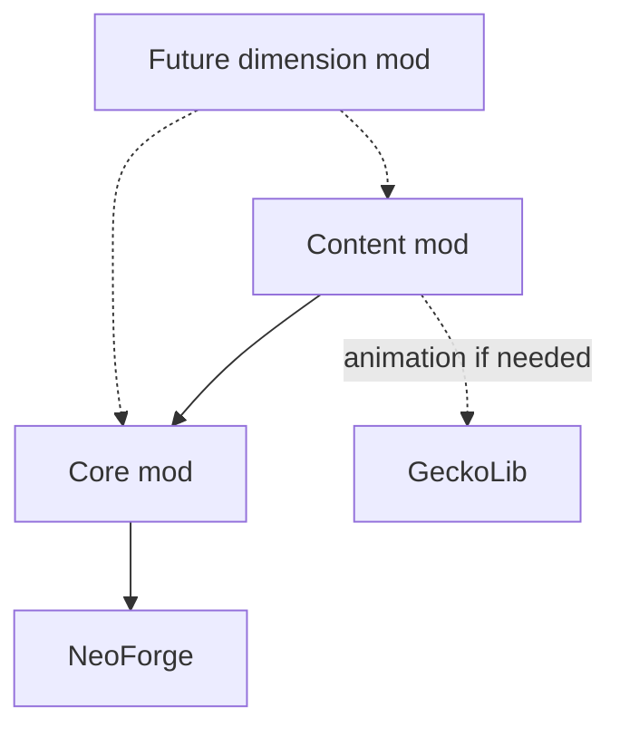

# Phase 2 — Product requirements

**Project:** Original high-fantasy Minecraft modpack; title undecided  
**Version:** PRD draft 0.2 — 2026-09-05  
**Status:** For review; not an implementation authorization  
**Technical foundation:** Minecraft 26.1.2, NeoForge, Java 25, ModDevGradle  
**Research:** docs/01-research.md, dated 2026-09-04  
**Next gate:** Approve/revise this PRD before Phase 3, docs/03-roadmap.md and CLAUDE.md.

## 1. Confirmed direction and boundaries

This document records the latest user decisions. They supersede earlier party-progression recommendations and unanswered context in the historical research document.

| Topic | Confirmed requirement |
|---|---|
| Team | Two strong Java developers; one has some modding experience, one none |
| Capacity | Six hours each per week: approximately 12 combined developer-hours |
| Ownership | All gameplay mods, code, names, lore, and assets are original |
| Libraries | Proportionate API/utility dependencies allowed; small demonstration items are acceptable |
| Server | Target up to 20 concurrent players on a private server; hosting provider undecided |
| Progression | Per player, replacing the earlier party-shared proposal |
| Sharing | Players may receive and trade gear; using gated gear requires the recipient's own unlock |
| Vanilla integration | Separate bosses unlock iron, gold, diamonds, and Nether access |
| Initial scope | One dungeon, one boss, one unlock, a reforging interaction, and a few blocks/weapons |
| Dimensions | Custom dimensions come later |
| Team roles | Flexible; either developer may take a task |
| Time horizon | Hobby project without a deadline |

**PvE interpretation:** the user wrote “Coop pve focus only, pve can come later.” This draft records the clear co-op PvE focus and interprets the second occurrence as **PvP**. PvP design is deferred; correct this interpretation if needed.

**Version qualification:** approval was conditional on adequate mod support. The official 26.1.2 NeoForge template and matching library releases exist. This supports the narrow dependency strategy; it does not establish the biggest mod catalog or a tested installation. Revalidate the pinned combination during setup. [Official MDK](https://github.com/NeoForgeMDKs/MDK-26.1.2-ModDevGradle); [Curios 26.1.2 release, 2026-07-19](https://www.curseforge.com/minecraft/mc-mods/curios/files/8463519). Verified 2026-09-04; see Phase 1 for the full comparison.

### How to read the draft

- **Confirmed:** explicitly chosen by the user, as recorded above.
- **Proposed:** recommended design for approval, not an assumed preference.
- **Review blocker:** a decision whose answer can materially change the design or implementation.
- All names, tuning values, content counts, and completion times below are **proposals**. Completion times describe player time, not development estimates.

The PRD is complete enough to review, but the gating questions in Section 13 must be settled before implementation.

## 2. Vision and pillars

**Vision:** A cooperative survival adventure in which players earn the right to wield increasingly powerful materials by overcoming readable encounters, then use those materials to build, explore, and shape their own equipment.

**Original premise:** Forgotten wardens bound the working of powerful materials to four personal seals. Ore remains visible in the world, but its deepest uses answer only to an adventurer who has earned the corresponding seal. The last warden guards passage into the Nether. This is an original working premise, not final lore or a requirement to hide ores.

Terraria supplies the rhythm of discovery, preparation, mastery, and reward. Minecraft supplies the shared world, building freedom, mining, spatial combat, and cooperative problem-solving. Do not reproduce Terraria's characters, item names, sprites, bosses, dialogue, or exact progression.

| Pillar | Product rule | Evidence of success |
|---|---|---|
| Earn progress through mastery | Bosses teach readable mechanics; required progress never depends on a rare random drop | Players can explain a failed attempt and improve without hours of compulsory farming |
| Gear deserves investment | Weapons have distinct roles; improvements are understandable and bounded | Players can explain why they chose a weapon and whether a reforge helped |
| Explore with a purpose | Every required dungeon gives a clue, an encounter, and a useful reward | No required trip exists only to pad travel time |
| Help friends without erasing their journey | Credit belongs to participants; trading is allowed; late players can replay earlier encounters | A new player can progress on an established server without a world reset |
| Preserve the shared sandbox | Avoid global terrain transformations and broad building restrictions | Different progression levels can live and build together |

**Primary player:** a survival player who enjoys cooperative combat and building but should not need a wiki to find the next required objective.

## 3. Scope and player journey

### Release boundaries

| Release | Playable promise | Deliberate limit |
|---|---|---|
| Vertical slice | Discover a small quarry dungeon, defeat the first boss, earn iron access, use one reforge, and reconnect with progress intact | Only the iron gate is implemented; no complete four-boss campaign and no custom dimension |
| MVP | A complete two-boss arc covering iron and gold, repeat fights, multiplayer credit, and the basic gear/economy loop | It is explicitly a partial campaign; diamond and Nether gates are not advertised as implemented |
| v1.0 | Four original bosses and four dungeons integrate iron, gold, diamonds, and Nether entry into one personal progression path | No new dimension, town simulation, or public-server ecosystem |
| Later expansion | One complete custom dimension with its own reason to visit and a safe return path | Multiple dimensions are not a v1.0 promise |

During slice/MVP tests, unsupported later gates remain ordinary vanilla behavior. A test guide identifies the intended endpoint; do not block unfinished tiers behind unavailable bosses. Stable long-lived worlds begin with the complete v1.0 ruleset.

### Progression skeleton

Time ranges assume a new player or small cooperative group at default settings, including exploration and a few attempts. They exclude major building projects and do not multiply by server population.

| Stage | Expected equipment on entry | Objective and original boss concept | Personal unlock and new activity | Target incremental player time |
|---|---|---|---|---|
| 0 — First shelter | Wood/stone, optional copper equipment, and ordinary survival supplies | Find the **Rootscar Quarry** and defeat **Marlroot, the Quarry Warden** | Iron seal: iron equipment and basic reforging service | 1–2 hours |
| 1 — Working iron | Iron equipment; modest weapon improvements | Explore the **Hollow Mint** and defeat **Veyra, the Gilt Cantor** | Gold seal: gold equipment and stronger reforging options/catalysts | 2–3 hours |
| 2 — Resonance | Iron gear with gold-enabled improvements | Navigate the **Glassvein Vault** and defeat **the Veinbound Hart** | Diamond seal: diamond equipment and the proposed enchanting-station gate | 2–3 hours |
| 3 — The last seal | Diamond equipment; bounded enchantments/reforges | Enter the **Cinderlock Bastion**, an Overworld ruin, and defeat **the Ashen Lockkeeper** | Nether seal: the player may enter the Nether, including existing portals | 2–3 hours |
| 4 — Open frontier | All four seals | Explore the Nether and pursue the ordinary vanilla endgame | Vanilla resources, brewing, Netherite and End progression under their normal remaining requirements; repeat bosses and complete optional builds | 3–6 hours to a chosen vanilla objective; sandbox thereafter |

**Targets:** 7–11 hours to open the Nether; roughly 10–17 hours through the proposed v1.0 journey including a vanilla endgame objective. These are tuning hypotheses, not promises.

Gold is a **crafting and improvement tier**, not a claim that vanilla gold armor is stronger than iron. The gold boss must grant a useful new improvement option even if the player keeps iron armor.

Copper equipment exists in the chosen Minecraft generation and remains ungated in this proposal. It is an optional pre-iron preparation route, not a fifth boss tier. Tune the first fight to remain beatable with a basic stone/leather kit. [Mojang's copper equipment release notes, 2025-09-30](https://www.minecraft.net/en-us/article/minecraft-java-edition-1-21-9), verified 2026-09-04.

**Proposed order:** iron → gold → diamonds → Nether. The user confirmed the four gates, but not this exact ordering. No additional custom boss gate for Netherite, the End, or elytra is included in v1.0.

### Encounter identity

| Boss | Core lesson | Initial moves | Build/escape treatment |
|---|---|---|---|
| Marlroot | Read a windup, move, then punish recovery | Directional stone sweep; delayed ground fissure | No required shield or iron item; terrain use is allowed, but the boss disengages if nobody remains in its arena |
| Veyra | Control space and choose a safe lane | Alternating marked lanes; exposed recovery after a short pulse sequence | Grounded encounter; no flight system required |
| Veinbound Hart | Bait a charge and respond to a clear opening | Telegraphing charge; breakable crystal obstruction within the arena | No permanently invulnerable puzzle phase or precision platforming requirement |
| Ashen Lockkeeper | Combine movement and target priorities | Marked heat zones; a small bounded set of summoned hazards | No Nether material, brewing product, or Nether-only counter required to win |

Avoid unavoidable damage, long invulnerability, and difficulty based only on health inflation. Mechanics must work solo. Later bosses may reuse technical foundations, but each needs a different decision from the player.

## 4. Core systems

### 4.1 Personal progression and material gates

**Purpose:** make vanilla advancement part of the adventure while letting players at different stages share a world.

**Player experience:** a short journal shows earned seals, the next clue, and the uses each seal unlocks. It is available from first login without an iron compass or purchased book. Locked actions explain the required boss. Players retain seals after death and reconnecting; another player's victory does not silently grant them progress.

**Proposed material policy — review blocker:** gate equipment and selected progression stations, not every item containing a metal. Raw resources, trading, storage, decoration, and ordinary building remain possible. This makes “unlock iron” an unlock of its progression uses rather than removing iron from the world.

| Action | Proposed rule before the corresponding personal seal |
|---|---|
| Pick up, trade, store, or display advanced gear/materials | Allowed; ownership is never restricted |
| Mine ore with an otherwise suitable tool | No additional ore-visibility/drop gate; existing tool requirements still apply |
| Craft gated equipment manually | Denied with a clear reason |
| Attack, mine, block, or gain armor benefits using gated equipment | Denied; do not silently grant the restricted attributes |
| Equip gated armor through a normal interface | Denied safely; an already-equipped item from migration is retained but inactive |
| Automated crafting, advanced-player crafting, loot, or villager acquisition | May produce/provide the item; the recipient's use gate still applies |
| Ordinary utility or decoration, such as a bucket or building block | Allowed unless explicitly listed as a progression-critical exception |
| Iron shield/anvil, advanced reforge service, enchanting table | Explicit proposed progression exceptions; shield/anvil require iron, higher reforge options require gold/diamond, enchanting requires diamond |
| Nether entry through any portal | Requires the entrant's Nether seal, regardless of who made or lit the portal |
| Return from the Nether | Always allowed; a lost/revoked flag must never strand the player |

**Confirmed gear-sharing rule — approved 2026-09-05:** anyone can receive, store, and trade gear, but must earn the corresponding personal seal to use it. Receiving a diamond sword does not permit its use before the recipient defeats the diamond-unlock boss. This decision is settled; the exact list of gated equipment and stations remains part of the material-policy review.

The exact equipment/station allowlist must be visible in data and documentation. Avoid scanning recipe ingredients to infer restrictions: a metal ingredient alone does not reliably describe an item's progression role.

**Implementation approach:** one server-owned progression service records a set of stable gate IDs per player UUID. World SavedData contains that ledger, encounter completion receipts, and schema version; clients receive only their relevant journal state. Separate world facts—structure positions and active encounters—from player entitlements. Every gate uses the same authorization service, including menus, item effects, station access, and dimension transitions. [NeoForge SavedData](https://docs.neoforged.net/docs/datastorage/saveddata/); [network payloads](https://docs.neoforged.net/docs/networking/payload/), documentation accessed 2026-09-04.

**Unlock trigger:** a validated boss completion grants its seal to eligible participants once. Inventory loot is separate from the seal; losing or trading a trophy never removes progress. Admin repair tools are logged and explicit. Never use an advancement toast as the only durable record.

**Dependencies:** encounters, gate definitions/tags, UI feedback, persistence, networking.

**Slice/MVP:** implement and audit the supported iron/gold actions only. **v1.0:** all four gates, all listed acquisition/use paths, recovery/admin tools. **Later:** optional alternate progression branches.

### 4.2 Cooperative encounters and individual credit

**Purpose:** make helping, late joining, and replaying bosses reliable without a party-progression system.

**Player experience:** players join an encounter at its altar and see who will receive first-clear credit. An experienced friend can help. Nobody must land the final hit, and a death during the fight does not automatically erase earned participation.

**Proposed credit policy:**

1. A player with the required earlier seals opts in at the altar before the fight starts. Each participant sees the same roster.
2. Record the roster at the start. Players can join later for assistance, but first-clear eligibility begins with the next attempt.
3. A registered player who remains engaged in the arena qualifies; death during that attempt retains eligibility. No damage quota excludes a support player.
4. A disconnected registered participant has a proposed 60-second credit grace period. Persist qualifying completion to their UUID even if they are offline when it occurs.
5. Victory grants each eligible player their own seal and personal reward entitlement. Repeated death events or reloads cannot grant duplicate first-clear rewards.
6. Earlier bosses are repeatable with common summon materials. Replays remain available after another player completes the dungeon.

“Engaged” initially means opted in and present in the encounter area, not an elaborate contribution-score system. Intentional assistance/carrying is permitted. No v1.0 anti-AFK scoring system is promised.

**Scaling proposal:** tune mechanics first for 1–4 participants. Health and bounded add counts scale with the roster; damage does not multiply with player count. Support up to 20 participants without excluding players, but test a full group separately. Lock scaling at start so disconnects cannot repeatedly manipulate it; a complete wipe resets the attempt.

**Failure and persistence:** no active participants for a short grace window ends and resets the fight. On server restart, cancel unfinished encounters safely, preserve completed seals/claims, clear owned hazards, and permit a retry without a rare-material loss. Do not try to resume a partially serialized combat simulation in v1.0.

**Implementation approach:** server-authoritative encounter state machines own AI, damage, roster, completion, and hazard lifetimes. Clients render telegraphs. An encounter ID ties reward receipts to one fight; inventory delivery has a persisted claim state and a defined crash-recovery path.

**Dependencies:** progression, boss entities, arena bounds, persistence, loot, networking.

**Slice:** two-client death/reconnect/reward tests. **MVP:** repeated fights and multi-encounter functional tests. **v1.0:** verify both a mixed 20-player server and a 20-player boss encounter.

### 4.3 Reforging

**Purpose:** turn familiar equipment into a project without requiring a huge weapon catalog.

**Player experience:** **Ena, the Benchwright**, offers a service at a modest workshop. The player's own seals determine available services. The interface shows the item, current modifier, cost, eligible outcomes, and stat changes. Ena is an original character with original dialogue and appearance.

| Rule | Proposed design |
|---|---|
| Equipment coverage | Weapons first; armor by v1.0; accessories only if the optional accessory system is later approved |
| Modifier slots | One modifier per eligible item |
| Pool size | Slice: two authored choices; MVP: six definitions; v1.0: twelve definitions across weapon/armor eligibility pools |
| Grades | Tempered, Honed, Exalted; iron/gold/diamond seals unlock the corresponding maximum grade |
| Effect budget | Small, explicit trade-offs or benefits; initial target approximately 5–12% in the modified property, with special handling for attack-speed breakpoints |
| Example identities | Durable: slower wear; Poised: bounded attack improvement; Surefooted: bounded armor-related resistance |
| Eligibility | Tags and modifier families prevent nonsensical results; no universal stack of damage/speed/luck bonuses |
| Currency | Tradable Ward Dust from dungeon rewards, plus an appropriate unlocked material |
| First interaction | One guaranteed affordable improvement; no random failure |
| Cost preview | Exact cost and before/after numbers; server confirms affordability |

**Slice:** choose one known modifier for a fixed price. This proves the service, persistence, attributes, and multiplayer transaction without building the full reroll workflow.

**MVP onward:** pay to generate one alternative, then keep the current result or accept the offer. Payment is not refunded for rejecting an offer. Persist the pending choice so closing the screen or disconnecting neither rerolls for free nor destroys the item. This richer flow is explicitly outside the slice.

**Balance proposal:** within the player's unlocked grade ceiling, start with weights 70/25/5 for the available grades, renormalized when a grade is unavailable. Exact weights and costs are tuning data; do not promise that a certain number of rolls guarantees the best result. No negative modifiers or item destruction in v1.0.

**Implementation approach:** store the item's modifier ID, resolved values, and format version in item data components. Definitions are validated data; the server owns random generation and the purchase. A session validates the current item and price, consumes resources once, and records the resulting item/pending offer. Validate simultaneous clicks, shift-clicks, full inventory, disconnect, and restart recovery. Never trust stat values supplied by the client. [NeoForge item components](https://docs.neoforged.net/docs/items/datacomponents/), accessed 2026-09-04.

**Dependencies:** personal gates, item tags/components, server menus, currency, NPC service, localization.

**Why this scope:** one modifier creates meaningful gear variation; sockets, enchantment replacement, multiple affix slots, and a complete crafting-quality system would multiply tuning work.

### 4.4 Dungeons

**Purpose:** make exploration deliver deliberate encounters and required progression without endless search.

**Player experience:** an early clue leads to a themed ruin, where a small number of rooms teach the boss's mechanic before the arena. Required rewards are distinct from optional treasure. The first location is discoverable through an in-game journal/guide, not external coordinates.

| Dungeon | Biome relationship | Layout target | Reward identity |
|---|---|---|---|
| Rootscar Quarry | Surface-accessible woodland or plains edge | 3 rooms plus arena | Stone/iron weapon path, first Ward Dust, quarry masonry |
| Hollow Mint | Dry hill or badlands-adjacent ruin | 4 rooms plus arena | Gold reforging catalyst, instrument/metal decoration |
| Glassvein Vault | Rocky or mountainous terrain with a readable surface marker | 4 rooms plus arena | Diamond-tier weapon options, crystal decoration |
| Cinderlock Bastion | Overworld volcanic-looking ruin built from authored blocks; no new biome required | 5 rooms plus arena | Nether seal, final crafting recipe rewards, dark masonry |

**Generation recommendation:** hand-build one canonical layout per dungeon. Store builds as NBT templates and author placement data. Do not develop a general dungeon graph generator for v1.0. Variant palettes and a small number of alternate side rooms may be considered only after the canonical builds pass tests.

**Discovery guarantee:** before shipping a required gate, validate a bounded search region across a documented seed set and provide a safe fallback placement/discovery path. A map cannot point to a nonexistent structure. No first boss should require a special tool, dimension, or rare biome that it itself unlocks.

**Keys:** the altar checks the initiating player's prerequisite seals and consumes a common-material summon offering. No one-time world key or unique chest item can permanently lock later players out. Required seals are awarded by the boss, not random chest rolls.

**Loot:** exploration chests contain supplies, decor, and optional gear; do not rely on them for personal first-clear essentials on a shared server. Those essentials come from the individual's boss claim. A previously looted dungeon must remain a viable catch-up route.

**Building:** outside an active encounter, preserve ordinary building/mining. During a fight, protect only the minimal arena mechanisms needed for a valid encounter. Do not restore entire structures over player builds after every clear. Critical altar recovery requires a deliberate, documented route.

**Dependencies:** structures/placement, gate service, boss encounters, journal/discovery, loot.

**Slice/MVP/v1.0:** one/two/four dungeon types. **Later:** bounded jigsaw assembly only when repeated play demonstrates a need for layout variety.

### 4.5 Dimensions and travel

**Purpose:** make new regions change the player's choices while preserving safe travel in a shared world.

**v1.0 Nether requirement:** a portal may exist or be lit before a player is eligible. The server checks the traveling player at the actual transition. Mount/passenger and alternate transfer paths must be considered in the supported-path audit. Denial leaves the player safe on the source side with a short explanation. Always allow an escape/return path. Ordinary survival players must not bypass the gate merely by following an advanced friend.

| Region | Theme and role | Entry | Hazards/resources | Return |
|---|---|---|---|---|
| Vanilla Nether — v1.0 | The frontier earned after the fourth seal | Existing portal mechanics plus a personal Nether-seal check | Existing vanilla hazards and resources; no terrain overhaul | Existing return portals; recovery handling prevents a revoked/missing flag from trapping someone |
| **The Hollow Aurora** — post-v1.0 concept only | A cavernous twilight realm whose minerals respond to light | Proposed crafted beacon after the Nether milestone; its exact recipe/boss gate remains undecided | Short-range visibility pressure, light-sensitive enemies, an original luminous crafting material with a defined use | Arrival platform and linked return beacon; recovery item crafted from resources available inside |

The future region is a design direction, not funded v1.0 content. Start it with existing noise/biome generators, one biome, one resource loop, and one dungeon. No custom sky renderer or novel terrain algorithm is assumed.

**Dependencies:** progression, safe-position selection, portals, chunk loading, saved return locations; future dimension additionally needs worldgen and its own content budget.

**Slice/MVP:** no custom dimension and no unimplemented Nether gate. **v1.0:** Nether gate. **Later:** at most one complete custom dimension before considering another.

### 4.6 Blocks and building materials

**Purpose:** let progression enrich bases as well as combat.

**Player experience:** each dungeon introduces a coherent small palette. Functional stations have an obvious purpose; decorative variants remain inexpensive enough to build with.

| Content band | New functional block IDs | New decorative block IDs | Examples |
|---|---:|---:|---|
| Starting camp / quarry | 2 | 8 | Encounter altar, reforge bench; quarry stone family |
| Gold arc | 2 | 12 | Service/encounter additions; warm metal and mint masonry |
| Diamond arc | 2 | 14 | Crystal utility/encounter additions; vault palette |
| Nether gate arc | 2 | 14 | Final encounter additions; bastion masonry |
| **v1.0 total** | **8** | **48** | **56 registered block IDs** |

These are ceilings to plan against, not incentives to invent unnecessary stations. Reuse the same bench and altar behavior across tiers wherever possible. Slabs, stairs, walls, and distinct registered variants count toward these totals; textures and blockstates do not create extra “content” counts.

**Implementation approach:** register ordinary blocks in Java; generate repetitive recipes, models, blockstates, tags, and loot. Prefer non-ticking decoration. Functional blocks share a small set of tested behaviors.

**Dependencies:** registries, datagen, material recipes, service/encounter logic.

**Slice:** 2 functional + 8 decorative. **MVP:** 4 + 20. **v1.0:** 8 + 48 maximum. **Later:** more palettes only when the core catalog is complete.

### 4.7 NPCs and a small hub

**Purpose:** give progression a human point of contact without simulating a town.

**Player experience:** a compact workshop provides Ena's reforging service. By v1.0, **Keeper Sile** provides clues and recovery guidance. NPCs can be encountered regardless of world progression, but dialogue and services check the individual player's seals.

**Scope:** one NPC in slice/MVP; two in v1.0. No housing validation, happiness, schedules, population growth, complex pathfinding, or player-specific NPC copies. Prevent a service NPC's death or disappearance from permanently locking progress; provide a simple recovery/respawn rule.

**Implementation approach:** simple custom entities with restrained movement, data-authored text/offers, and server-authoritative menus. A shared NPC can serve two clients through separate sessions. Reuse vanilla-style interfaces where practical.

**Dependencies:** services, progression queries, dialogue/localization, structure placement, entity persistence.

**Recommendation:** use a workshop, not a town system. NPC simulation would consume time without proving the central combat/improvement loop.

### 4.8 Loot, rarity, and economy

**Purpose:** reward exploration and repeated play without making required progression a lottery.

**Player experience:** every first clear earns the seal and a useful guaranteed claim. Repeat clears yield modest improvement resources and optional drops. Ward Dust can be traded; it has no real-money relationship.

| Category | Rule |
|---|---|
| Required progress | Guaranteed, personal, repeat-safe; never a rare drop |
| First-clear gear/resources | One persisted claim per eligible player per boss |
| Repeat rewards | Smaller predictable resource grant plus optional loot |
| Rarity | Common, Uncommon, Rare; always labeled in text as well as color |
| Reforge grade | Separate from drop rarity; a Rare weapon does not automatically bypass a material seal |
| Currency sources | Dungeon encounters and boss rewards; no unlimited vendor buy/sell loop |
| Currency sinks | Reforging and explicitly priced optional services |
| Crafting | Needed recipes are visible with lock explanations; no external recipe viewer required |
| Salvage | Deferred; do not add another conversion economy before costs and rewards are measured |

Initial balance target: a normal dungeon completion funds at least one useful improvement. A failed boss attempt should not require repeating the full resource grind. Do not award more total shared loot merely because someone repeatedly joins/leaves the roster.

**Implementation approach:** vanilla loot tables where sufficient; custom server code for personal first-clear claims and bounded rewards. Data definitions expose weights, quantities, and costs. Validate impossible entries, negative prices, and loops before accepting a reload.

**Dependencies:** encounters, inventory delivery/recovery, item definitions, reforge costs.

**Slice:** one currency and guaranteed rewards. **MVP:** basic rarity and repeat economy. **v1.0:** tune all four arcs; no auction house, player marketplace, or global stock simulation.

### 4.9 Enemies, combat, and scaling

**Purpose:** teach boss mechanics in normal fights and give equipment roles without making every enemy a damage sponge.

**Player experience:** quarry enemies telegraph slow attacks; mint enemies train lane awareness; vault enemies train charge avoidance. Visible behavior communicates danger before numerical stats matter.

**Scope:** two original non-boss enemy types in the slice, four in MVP, eight in v1.0. Variants using the same behavior do not count as new types. Vanilla ambient enemies remain; no complete mob replacement.

**Rules:** keep the Overworld stable for late players. One player's seal does not globally strengthen every zombie or convert terrain. Scale a boss to its registered encounter roster, not to the strongest player anywhere online. Advanced allies may help; no PvP balance or forced level normalization is included.

**Implementation approach:** small reusable goal/state behaviors; server-owned damage and target selection; bounded projectiles/adds; client-only rendering isolated from dedicated-server logic. Tune enemies against the equipment available before their gate.

**Dependencies:** entity registration, attributes, effects, encounter roster, animation/audio.

**MVP:** readable melee/ranged roles and one restrained elite variant. **Later:** faction relationships and invasions only if the base encounters remain performant.

### 4.10 Optional systems

None of these is required for the v1.0 campaign. A feature enters scope only by replacing other work or through a separately approved expansion.

| Optional system | Why it may fit | Minimum sensible version | Dependencies / cost |
|---|---|---|---|
| Accessories | Adds build choices without replacing armor | Two slots and a few original effects after the core gear loop | Curios integration, UI, balance, save/sync checks |
| Original buffs/potions | Adds expedition preparation | A few situational effects using existing systems | Effect definitions, recipes, accessibility, boss balance |
| Events/invasions | Gives a developed base a combat purpose | One voluntary, bounded event with an explicit end condition | Spawning, protection, performance, rewards; high scope cost |
| Fishing | Creates an optional calm reward loop | A small biome-specific table with no required progression item | Loot, tools, economy; low technical but ongoing content cost |
| Mounts | Makes travel feel different | One mount only after movement and exploration needs are measured | Entity control, animation, collision, networking; high scope cost |

Existing vanilla activities can continue. “Optional” here refers to new original systems, not disabling vanilla fishing or potions.

## 5. Mod architecture

**Recommendation:** one repository, one coordinated release, and **two owned mods**: a small core/library mod and one content mod. Organize content internally by system and encounter; do not create one published mod per boss, material, or dungeon.

| Module | Owns | Must not own |
|---|---|---|
| Core mod | Gate/encounter identifiers and contracts, personal progression service, shared serialization/versioning, common networking/config helpers | Boss identities, item art, dungeon builds, per-tier loot, large speculative frameworks |
| Content mod | All four bosses, enemies, items, blocks, structures, NPCs, reforge implementation, journal/UI, data and assets | Duplicate progression stores or direct edits to another system's private state |
| Future dimension mod | Its own dimension definitions, resource loop, encounters, and assets | A second incompatible gate/gear system |

Arrows mean **depends on**. Dashed edges are deferred or conditional.

Curios is not a required dependency while accessories are out of scope. If approved later, its adapter belongs beside the content equipment system. JEI is an optional utility, not an authority for recipe eligibility.

### Shared APIs and registrations

- Expose a small progression query/grant API and encounter-completion contract. Granting remains a server-only operation.
- Core defines shared data types and schemas; content registers specific gate definitions and content entries under its own stable namespace.
- Use namespaced registry keys and deferred registration. Resolve references through registries and contracts, not static initialization order.
- Store declared dependencies in mod metadata and fail clearly when a required module/version is missing.
- Keep common/server code free of physical-client imports. UI and renderers use an explicitly separate client package.
- Keep pure cost, eligibility, and progression rules independent of world state where possible so they can be tested without booting Minecraft.

Actual mod IDs and the permanent project name are selected before registration begins. A proposed display name in this PRD is not permission to make an unstable identifier part of a save.

### Configuration and data ownership

| Mechanism | Appropriate content | Reload contract |
|---|---|---|
| Server configuration | Encounter caps, approved difficulty/accessibility policies, administrative recovery settings | Synced where clients need it; restart requirements documented |
| Client configuration | HUD, subtitles/visual emphasis, screen shake, particles | Immediate where safe; never changes server rewards or eligibility |
| Datapack definitions | Gate prerequisites, item eligibility tags, loot, modifier pools, costs, supported encounter tuning | Validate IDs, graph cycles, bounds, and references before activation |
| Startup/worldgen data | Registries, structures, dimension definitions | Not advertised as a general live-reload feature |
| Resource assets | Text, models, textures, sounds, icons | Standard resource reload where supported |

A successful data reload swaps a complete validated snapshot. An invalid reload preserves the last good runtime snapshot and reports actionable errors. Saved rolled values and pending offers do not silently change because a pool was rebalanced. Earned seals remain earned when balance changes; removing an ID requires a migration decision.

Both mods share a coordinated pack version initially. The core API is internal to this project; do not promise a public plugin API in v1.0.

**Why not more mods?** With two developers, packaging and dependency management would grow faster than useful separation. **Why not one inseparable mod?** A small shared contract boundary makes later dimension work and testing easier. Do not let the core grow into a framework without a second actual consumer.

Technical grounding: [NeoForge registries](https://docs.neoforged.net/docs/concepts/registries/), [configuration](https://docs.neoforged.net/docs/misc/config/), and [sides](https://docs.neoforged.net/docs/concepts/sides/), accessed 2026-09-04.

## 6. Content targets

These are **cumulative ceilings**, not counts to be added together across releases. Every counted entry needs an actual player purpose, assets, localization, and validation.

| Content | Vertical slice | MVP | v1.0 |
|---|---:|---:|---:|
| Original bosses / personal boss gates | 1 / 1 | 2 / 2 | 4 / 4 |
| Custom dimensions | 0 | 0 | 0 |
| Gated vanilla dimensions | 0 | 0 | 1: Nether |
| Dungeon types | 1 | 2 | 4 |
| Original weapons | 4 | 8 | 16 |
| Original armor sets / individual armor items | 0 / 0 | 0 / 0 | 1 / 4 |
| Functional blocks | 2 | 4 | 8 |
| Decorative blocks | 8 | 20 | 48 |
| **Total registered blocks** | **10** | **24** | **56** |
| NPCs | 1 | 1 | 2 |
| Non-boss enemy types | 2 | 4 | 8 |
| Modifier definitions | 2 | 6 | 12 |
| New accessory items | 0 | 0 | 0 |
| Original crafting/reward materials, excluding block items | Up to 3 | Up to 6 | Up to 10 |

Weapon target for v1.0: approximately ten melee, four ranged, and two simple cooldown-based magical focuses. This is a content allocation, not a mandate for sixteen unique combat engines. Reuse a small set of clear behaviors; no new mana system is required. Armor reforging can apply to eligible vanilla armor before adding an original set.

The four slice weapons should cover pre-iron and post-iron choices so the first reward is usable. Recolors alone do not count as distinct weapons. Boss loot, currencies, and trophies must fit the material/item budget rather than silently expanding it.

## 7. Non-functional requirements

All performance figures are **acceptance targets**, not measured claims. Before performance sign-off, record CPU/GPU, RAM and heap limit, operating system, seed, view/simulation distance, resolution, and test scenario. Reference hardware remains undecided and must be established in Phase 3.

| Area | Proposed requirement |
|---|---|
| Server performance | Target 20 TPS, p95 tick time at or below 40 ms and p99 at or below 50 ms during a defined 30-minute steady-state workload |
| Exploration performance | Run a separate new-chunk exploration scenario; measure generation stalls and memory growth rather than hiding them inside average TPS |
| Client performance | Target 60 FPS at 1080p on the agreed reference client during a four-player boss; record frame-time spikes and also test a 20-player encounter |
| Server capacity | v1.0 supports 20 concurrent players; verify a mixed workload of combat/building/travel and an all-20-player boss scenario |
| Early capacity validation | Slice: 2–4 real clients; MVP: 8-client functional sessions plus a 20-client load smoke test; v1.0: full 20-player acceptance profiles |
| Encounter cost | Bound active adds, projectiles, area scans, and temporary effects per encounter; clean them up after reset and chunk unload |
| Memory | No unbounded retained growth after repeated fight/reset and travel cycles; retain heap/profile evidence against the declared heap limit |
| Networking | Send state changes or bounded updates; no per-tick full-inventory/world scans or client-authoritative progression/currency mutations |
| Dedicated server | A release build loads and runs without client-only classes; client/server mod and data compatibility is checked |
| Save durability | Seals survive death, logout, restarts, and tested compatible updates; pending claims/offers recover according to documented rules |
| Fresh-world policy | v1.0 progression guarantees target a fresh world; importing arbitrary existing modded saves is out of scope |
| Compatibility policy | Slice/MVP worlds may reset with notice. v1.x preserves IDs and earned progress through tested migrations; downgrade support is not promised |
| Data extensibility | Supported definitions can be overridden without code; invalid data is rejected clearly; reload boundaries are documented |
| Config consistency | Server controls shared rules; clients cannot select cheaper costs or bypass gates using local config |
| Diagnostics | Logs identify encounter ID, relevant registry IDs, and failed operation without flooding every tick |
| Recovery | Document backups, claim recovery, missing-NPC/altar recovery, and safe escape from a dimension |
| Accessibility | Text labels supplement rarity color; visual and audio attack cues; subtitles; readable scalable UI; remappable actions |
| Comfort | Disable screen shake, reduce flashes/particles, avoid required rapid clicking and color-only puzzles |
| Originality | Keep editable source assets and provenance; include required library notices; no copied third-party gameplay code/assets |

Accessibility settings should change presentation without granting different hidden combat outcomes. If reduced motion removes a cue, an equivalent static marker must remain.

**20-player qualification:** this is a delivery target, not proof of capacity. A successful two-client demonstration does not satisfy it. Synthetic load can expose bottlenecks, but final usability needs real-player sessions.

## 8. Acceptance criteria

These define product outcomes. They do not prescribe a test implementation or replace the future roadmap.

| ID | Required outcome | First required release |
|---|---|---|
| AC-01 | A new player can find the first dungeon and understand the iron gate using in-game information | Slice |
| AC-02 | The first boss is beatable with the explicitly available pre-iron kit, without advanced gear from another player | Slice |
| AC-03 | A qualifying clear grants the correct personal seal; another online non-participant remains locked | Slice |
| AC-04 | An eligible player and a locked player can share the same world, chest, and service NPC without exchanging progression state | Slice |
| AC-05 | A shared iron item can be received safely; its behavior matches the approved gear-use policy | Slice |
| AC-06 | The first reforge charges once, changes the correct item, and survives reconnect/server restart | Slice |
| AC-07 | Death, full inventory, repeated completion events, and a disconnect do not delete a required reward or duplicate its first-clear entitlement | Slice |
| AC-08 | A later player can replay the first dungeon after it has already been cleared/looted | Slice |
| AC-09 | Iron and gold form a playable two-boss arc with a useful gold-enabled improvement | MVP |
| AC-10 | The reroll keep/accept workflow survives closing the UI and reconnecting without a free new roll | MVP |
| AC-11 | Every supported material-gate acquisition/use path has a documented expected result and is checked, including trading and automation-produced equipment | MVP for iron/gold; v1.0 for all gates |
| AC-12 | Two simultaneous encounters do not share rosters, hazards, reward IDs, or reset state | MVP |
| AC-13 | All four bosses can be reached and defeated in order without needing the material/dimension that they unlock | v1.0 |
| AC-14 | A locked player cannot enter the Nether through another player's portal; an eligible player can; return travel is never progression-blocked | v1.0 |
| AC-15 | A documented seed suite finds valid progression locations or exercises the safe fallback; no required structure placement overwrites protected/player construction | v1.0 |
| AC-16 | The agreed 20-player workload and client scenarios satisfy the recorded performance criteria, or the release target is explicitly revised | v1.0 |
| AC-17 | An agreed set of older supported saves migrates without losing earned seals or item identity | Every stable update |
| AC-18 | A player can identify attack cues and gear rarity with color distinctions disabled and screen shake off | Slice onward |
| AC-19 | Failed data reloads leave the last good runtime rules intact; unknown saved IDs use the documented recovery path | MVP onward |

**Qualitative slice gate:** after two short playtest sessions, players should understand what unlocked, identify at least one boss attack they learned, and choose to repeat or continue the loop. If the boss is merely a chore before ordinary Minecraft begins, revise the design before adding the second boss.

## 9. Out of scope for v1.0

- Custom dimensions or a novel terrain-generation engine.
- PvP balancing, competitive progression, public-server moderation/economy, and anti-cheat infrastructure.
- Party membership or shared party progression; cooperative encounter participation does not require a persistent party system.
- A procedural dungeon framework, infinitely varied layouts, or instanced copies per party/player.
- Global difficulty transformations or retroactive ore/biome replacement after a boss.
- Town simulation, housing/happiness, complex NPC routines, and voiced quest campaigns.
- Mounts, invasions, a new fishing system, new accessory content, and a separate mana system.
- Multi-loader or multi-Minecraft-version releases.
- A marketplace, auction house, real-money economy, custom launcher, or self-managed hosting platform.
- A complete replacement of vanilla progression beyond the approved gates.
- Reusing content mods as gameplay dependencies or copying another game's creative assets.

## 10. Risks and mitigations

| Priority | Risk | Mitigation / decision trigger |
|---|---|---|
| 1 | Scope exceeds approximately 12 combined hours/week | Enforce the slice and content ceilings. Add one system only after its predecessor is fun, reliable, and reviewable. Cut counts before sacrificing multiplayer correctness |
| 2 | Material gates touch many vanilla paths and feel restrictive | Approve the exact use/utility policy first. Prove iron through trading, armor, crafting, automation, and item use before duplicating the rule for other tiers |
| 3 | Shared equipment bypasses personal progression through an unchecked use path | Enforce the agreed recipient-use gate consistently; test a veteran/new-player pair together |
| 4 | 20-player correctness/performance appears too late | Dedicated server from the slice; scale tests in MVP; measure full 20-player profiles before v1.0 approval |
| 5 | Original assets become the bottleneck | Start with restrained models/palettes and short animations. Keep flexible roles but a named owner for each accepted task; do not promise professional-scale art volume |
| 6 | Required dungeon discovery or summon logic creates a dead end | Validate seeds, common-material summons, reset behavior, and a safe fallback before making a gate mandatory |
| 7 | Personal rewards or reforges duplicate/vanish on failure | Separate entitlement from inventory delivery, persist pending operations, and test restart/disconnect windows |
| 8 | Early bosses slow familiar vanilla tasks without adding enjoyment | Keep the iron arc short, its clues clear, and preparation inexpensive; revise based on first-session playtests |
| 9 | Loader/game changes consume hobby time | Freeze the selected Minecraft target through the slice; schedule deliberate migrations with save testing |
| 10 | Parallel edits collide despite flexible roles | Use small claimed tasks and peer review; let ownership rotate rather than assigning permanent specialties |
| 11 | Optional ideas quietly become requirements | Keep a separate backlog; no optional feature enters v1.0 without an explicit trade-off |

**De-risking recommendation:** the slice must prove the iron gate on a shared server, not merely show a boss model and a new sword. Stop expansion if the gate matrix, reward durability, or player comprehension fails.

At 12 combined hours/week, even 52 uninterrupted weeks would provide only 624 gross developer-hours before interruptions and overhead. This is a substantial hobby undertaking. Phase 3 will estimate ranges from this scope and revise them after measured slice work; this PRD sets no delivery date.

## 11. Decision record for future sessions

| ID | Status | Decision / interpretation | Reason or consequence |
|---|---|---|---|
| D-01 | Accepted direction; setup validation pending | 26.1.2, NeoForge, Java 25, ModDevGradle | Official tooling and matching relevant libraries exist; compile/load verification remains necessary |
| D-02 | Confirmed | 20-player private-server target | Must be tested explicitly; does not imply a public server |
| D-03 | Confirmed; supersedes party proposal | Progression belongs to each player | No shared party/world entitlement |
| D-04 | Confirmed | Gear sharing allowed | Possession and trade are unrestricted; recipient-use requirements are confirmed in D-10 |
| D-05 | Confirmed | Bosses unlock iron, gold, diamonds, and Nether | Four required v1.0 gates |
| D-06 | Confirmed | Small first build; dimensions later | Slice focuses on iron and the core loop |
| D-07 | Confirmed | Six hours each weekly; flexible roles | Estimate from 12 combined hours and choose ownership per task |
| D-08 | Confirmed | Small API-library demo items acceptable | Library still needs to justify its cost; this is not approval for third-party gameplay mods |
| D-09 | Confirmed focus; typo interpreted | Co-op PvE; PvP later | Resolves the repeated “PvE” in the user's message |
| D-10 | Confirmed 2026-09-05 | Share freely, but using gated gear requires the recipient's own seal | User approved personal use restrictions for gifted gear; no longer a review blocker |
| D-11 | Proposed | Gate equipment/stations; allow general resources, utility, and decoration | Limits vanilla disruption and implementation scope; review blocker |
| D-12 | Proposed | Iron → gold → diamonds → Nether | Four-stage arc without a dependency cycle |
| D-13 | Proposed | v1.0 contains no custom dimension | Concentrates production on four good Overworld encounters |
| D-14 | Proposed | Two owned mods in one repository | Minimal API boundary without per-system packaging overhead |

## 12. Vanilla integration edge cases

These must be explicit so a future implementation does not invent stricter rules than the team approved.

| Edge case | Proposed treatment |
|---|---|
| Nether resources gifted to a player without the Nether seal | Allowed; Nether entry is the gate, not possession of every Nether-derived item |
| Netherite equipment | Require the diamond and Nether seals for use; no fifth boss. This extension needs review with the material policy |
| An End portal opened by another player | No new End-entry gate currently proposed; a strict full-campaign rule would need explicit approval |
| An advanced player helping an earlier boss | Allowed without forced gear downgrading; the newer participant still earns their own seal |
| A player changing social groups | No change to earned seals |
| Existing vanilla world with advanced inventories | Not a supported automatic conversion target for v1.0; use a fresh world or a separately designed migration |
| Operator teleport or repair commands | Explicit administrative exception, not a supported survival bypass |
| Craftable recovery/summon item | Must use resources available before its own gate; creative-only recovery does not satisfy normal playability |

Consequently, the journey table describes the intended route, not an absolute prevention of every cooperative shortcut into vanilla endgame. Decide whether the End should inherit the Nether seal before claiming a fully enforced vanilla campaign.

## 13. Review questions and phase gate

**Resolved 2026-09-05:** shared gear requires the recipient's own unlock to use.

Remaining short questions for the developers:

1. **Material gates:** Lock equipment and key stations, while allowing ordinary materials, building, and utilities? Recommended: yes.
2. **Boss order:** Iron, then gold, then diamonds, then Nether? Recommended: yes.
3. **Vanilla endgame:** Should the Nether seal also gate Netherite use and End entry? Proposed: gate Netherite use; leave End entry unchanged unless a stricter campaign is wanted.
4. **Scope:** Approve four Overworld bosses and zero custom dimensions for v1.0? Recommended: yes.

The material-policy question blocks final gate design. Others confirm proposed scope and edge behavior. Numerical tuning, working names, exact art assignments, and hardware profiles can remain open for the roadmap and early playtests.

**Pause after review.** Do not write mod code or scaffold projects. On approval, Phase 3 will produce docs/03-roadmap.md and root CLAUDE.md with milestones, effort ranges, repository/session conventions, and a durable decision-log format.
