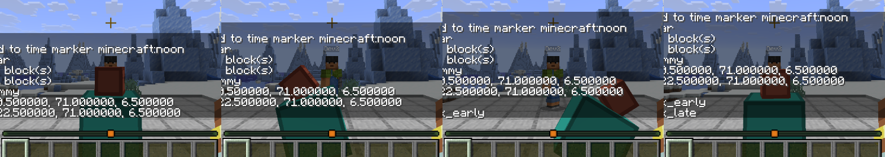
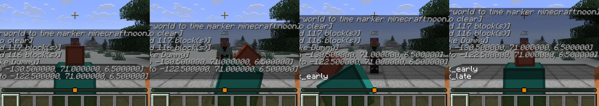

# Spike S2 — A Blockbench-style boss model animated through GeckoLib, server-triggered on two clients

Date: 2026-09-05 · Status: **answered yes: GeckoLib 5.5.5 runs on NeoForge 26.2, and a server-set flag plays the same attack on both clients at the same tick** · Code: `sb_bosses` (`SpikeDummy`, its generated assets, `BossDebug`, the `dummy_attack` game test); nothing here is content

## Question

Can we drive a GeckoLib 5.x model's animation from the server on 26.2 and have two connected clients see the same thing at the same time? Is there a GeckoLib build for 26.2 at all, what trigger path works, and where does GeckoLib hook the 26.2 submit pipeline (render states, `SubmitNodeCollector`)?

## What was built

| Piece | Where | Notes |
|---|---|---|
| GeckoLib 5.5.5 for NeoForge 26.2 as a dependency | `sb_bosses/build.gradle`, decision 0020 | Resolved from the Modrinth Maven by version id (`maven.modrinth:geckolib:fTK5ltWI`), because the version number 5.5.5 is shared by the Fabric and Forge jars. Loads as the mod `geckolib`; package `com.geckolib` |
| `sb_bosses:spike_dummy` | `sb_bosses` `entity/SpikeDummy`, `SbBossesEntities` | A `PathfinderMob` implementing `GeoEntity`: one controller, idle loop, attack once; a synced boolean `ATTACKING` raised by the server for 20 ticks by `attack()`, which a right-click (`mobInteract`) calls |
| Geometry, animations, texture | `assets/sb_bosses/geckolib/models/entity/spike_dummy.geo.json`, `geckolib/animations/entity/spike_dummy.animation.json`, `textures/entity/spike_dummy.png` | Two cubes (body, head on a pivot), an idle bob and a one-second rear-back-and-lunge, a flat-colour 64×64 texture, all written by `python tools/gen_spike_dummy.py` so the spike is reproducible; real bosses are authored in Blockbench, whose exports use the same formats |
| Renderer | `sb_bosses` `client/SbBossesClient` | `new GeoEntityRenderer<SpikeDummy, LivingEntityRenderState>(context, type)`: GeckoLib derives the three resource paths from the entity type id |
| Two-client harness `BossDebug` (`clientBoss`, `clientBossGuest`) | `sb_bosses` `client/BossDebug`, `sb_core` `client/dev/DevHarness` | The LAN-published integrated server pattern from S3, now shared in core: host creates a world, builds a flat stage, summons the dummy between the players, screenshots it idle, right-clicks it through the real interaction packet, screenshots at +6 and +14 ticks and after; the guest screenshots on each announcement; both log the world tick at which the synced flag flipped |
| Game test `sb_bosses_tests:dummy_attack` | `sb_bosses/src/gametest` | Spawns the dummy, right-clicks it with a mock player, asserts the flag is up, still up mid-animation, and clears after 20 ticks |

## What happened

| Check | Result |
|---|---|
| GeckoLib on 26.2 | **Yes.** 5.5.5 (published 6 Sep 2026, Modrinth) and 5.5.1–5.5.4 before it, all NeoForge 26.2. The mod loads next to ours; `Loaded 1 models and 1 animations from resources` |
| Trigger path | The server raises the synced `ATTACKING` flag; each client's `AnimationController` predicate reads it and plays the attack once. Host right-clicked at world tick 528; host and guest both logged `attacking=true` at world tick **529**. GeckoLib's own `GeoEntity.triggerAnim(controller, name)` (a packet to tracking clients, `triggerableAnim` on the controller) is the alternative; the flag was chosen because the server can be game-tested and the boss AI will own that state anyway |
| Both clients see the attack at the same moment | The four capture points match pose for pose (idle, rear-back with the head turned, lunge with the head down, recovery); the guest's capture is at most a tick behind the host's chat announcement |
| Headless | `:sb_bosses:runGameTestServer` 3/3 with GeckoLib loaded on the test server |

## The render-state hook (for the boss ticket)

GeckoLib 5.5 sits on the 26.2 pipeline rather than beside it:

- `GeoEntityRenderer<T, R extends EntityRenderState> extends EntityRenderer<T, R>`. `createRenderState` returns a vanilla `LivingEntityRenderState` for living entities (`EntityRenderState` otherwise); a client Mixin (`EntityRenderStateMixin`) makes every `EntityRenderState` a `GeoRenderState`, a map of GeckoLib `DataTicket`s.
- `extractRenderState(entity, state, partialTick)` calls vanilla's extraction, then `fillRenderState`, which runs the animation controllers (`AnimationController.extractControllerState`) and stores bone transforms and animation data on the state. **Animation is evaluated at extraction, on the game thread, with the entity in hand**; the render pass sees only the state.
- `submit(state, poseStack, SubmitNodeCollector, CameraRenderState)` walks the baked model and submits geometry through the collector, the same deferred path our first-person weapon uses; `GeoRenderLayer`s (glow, armor, held items) hang off the renderer.
- What this means for a boss: anything the animation must know (attack, phase, target direction) has to be on the entity or its synced data when extraction runs; render layers get the same state; there is no per-frame entity access during the render pass.

## Things learned that change the plan

- **Two ways to trigger, one rule.** Synced entity data plus a predicate is the default (testable, and the AI owns the flag); `triggerAnim` is right for one-shot flourishes (a roar on spawn) that no gameplay state needs to remember.
- **Boss animation state is gameplay state.** Because clients evaluate the controller predicates from synced data, the attack flag doubles as the hitbox timing source for the combat rules (PRD "every fight has rules"): the server's windup/active/recovery windows can drive both the animation and the hit test from one timeline, the way `sb_combat` does for players.
- **Assets are plain JSON and PNG.** Blockbench's GeckoLib export writes exactly `geo.json` + `animation.json`; the generator shows the shapes and lets tests build models without an artist.
- **The dev harness lives in core** (`dev.sealbreaker.core.client.dev.DevHarness`): world creation, LAN publishing with authentication off, the chat capture protocol, command-text helpers. Any module's capture run is now a state machine of a hundred lines.
- **A stone stage.** Spawn terrain varies wildly by seed (seed 4 spawns among ice spikes); harnesses that need a clean look build a flat platform instead of hunting for one.

## Not verified yet (needs a person at the keyboard)

- The animation seen live, at 60 fps: the captures are 6 and 14 ticks in; blending between idle and attack (2-tick transition) was not judged by eye.
- Sound and particle keyframes (GeckoLib supports both through the controller's keyframe handlers); nothing in the spike uses them.
- A dedicated server once a person accepts the EULA; the LAN path exercises the same code.
