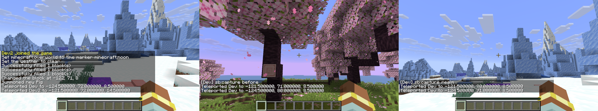
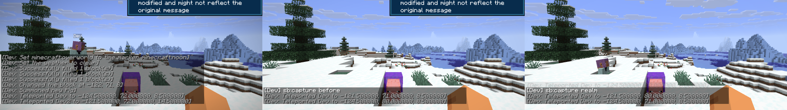
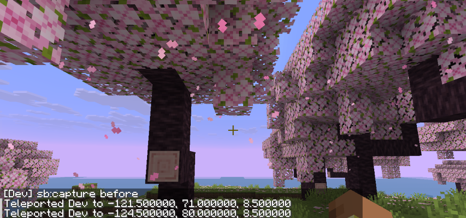

# Spike S3 — A JSON dimension with its own clock, entered through a block using the vanilla Portal interface

Date: 2026-09-05 · Status: **answered yes on all three parts** · Code: `sb_world` (`SpikePortalBlock`, the realm's data, `PortalDebug`, the `realm_data` game test), kept as the seed of realms (PRD 3.12); nothing here is content

## Question

The realm plan (Tiers 2–3) rests on an untested assumption: a custom dimension defined in JSON with its own daylight cycle can be entered through our own block via the vanilla `Portal` interface on 26.2, on a server with several players, and left again. Which interfaces, and what would a Seal gate on entry hook?

## What was built

| Piece | Where | Notes |
|---|---|---|
| World clock `sb_world:spike_realm` | `data/sb_world/world_clock/spike_realm.json` (`{}`) | 26.1+ clocks are registry entries with no fields; the server ticks each one with its own rate and pause |
| Timeline `sb_world:spike_realm_day` | `data/sb_world/timeline/spike_realm_day.json` | On our clock, `period_ticks` 12000 (a ten-minute day), markers `sb_world:day/noon/night/midnight`, and vanilla's eighteen visual and gameplay tracks (sky light, sun and moon angles, fog and sky colour multipliers, monsters burn, ...) scaled to the shorter day; generated by script from `minecraft:day` |
| Timeline tag `#sb_world:in_spike_realm` | `data/sb_world/tags/timeline/in_spike_realm.json` | `#minecraft:universal` plus our day |
| Dimension type `sb_world:spike_realm` | `data/sb_world/dimension_type/spike_realm.json` | The overworld's, with `default_clock` and `timelines` pointing at ours, a violet sky and fog (`minecraft:visual/sky_color`, `fog_color` attributes), beds disabled |
| Level stem `sb_world:spike_realm` | `data/sb_world/dimension/spike_realm.json` | `minecraft:noise` with a fixed cherry-grove biome on the overworld noise settings |
| `sb_world:spike_portal` | `sb_world` `block/SpikePortalBlock` | A lit, unbreakable, no-collision full block implementing `Portal`: `entityInside` → `entity.setAsInsidePortal(this, pos)`; `getPortalTransitionTime` 20 ticks; `getPortalDestination` picks the other level (overworld ↔ realm), keeps x and z, lands on `MOTION_BLOCKING` height there, lays a portal block at the landing if the spot is replaceable, and returns a `TeleportTransition` with `PLAY_PORTAL_SOUND.then(PLACE_PORTAL_TICKET)` |
| Two-client harness `PortalDebug` (`clientPortal` host, `clientPortalGuest`) | `sb_world` `client/PortalDebug`, `build.gradle` | The host creates a fresh world, opens it to LAN on port 25585 with `setUsesAuthentication(false)` so a second offline dev client can join by `--quickPlayMultiplayer`, and drives the trip; capture points are announced in chat so the guest screenshots the same moments |
| Game test `sb_world_tests:realm_data` | `sb_world/src/gametest` | Dimension type, clock and timeline load from data and point at each other with the 12000-tick period; the portal reports the missing level on the test server instead of teleporting a pig |

## What happened

Two clients on one integrated server published to LAN (seed 4; the same on seed 3):

| Step | Result |
|---|---|
| Host walks into the portal | In the realm after 27 ticks (20 of transition plus the client round trip), at the same x and z, on the realm's surface, standing in a freshly laid return portal |
| Guest watches from six blocks away | Sees the host vanish, the portal stay, and the host reappear (name tag in the captures) |
| Host steps out of and back into the return portal | Back in the overworld after 22 ticks, next to the original portal |
| A stationary NoAI pig beside the portal | Went through on its own on the first ticks and sat in the realm's return portal (vanilla refreshes the 300-tick cooldown while a mob stands in a portal, so it stays) |
| Clock readings taken on the server before and after, with the realm's clock rate set to 3 through `ServerClockManager.setRate` | Overworld +137 ticks, realm +411 ticks over the same interval: the realm runs its own clock at its own speed |
| Chunk loading | The destination chunk is loaded synchronously by the block before the transition, and `PLACE_PORTAL_TICKET` keeps it loaded after arrival; no stall seen on either client |

`:sb_world:runGameTestServer` 6/6 (core 2, combat 1, world 3).

## Answers

**A. A JSON dimension with its own clock: yes, and better than assumed.** 26.2's clocks and timelines are exactly the "own daylight cycle" the PRD wanted: the realm's day length, its time markers (`/time set sb_world:noon` inside the realm), every visual track, and the rate all live in data, and NeoForge's `ServerClockManager.setRate` (also `/neoforge day`) changes the speed at runtime. `has_fixed_time` remains available for a frozen sky. The sky and fog colours are dimension-type attributes; no NeoForge client event is needed for a colour change (one is only needed for a custom skybox).

**B. Entry through our own block via the vanilla `Portal` interface: yes.** Three methods; vanilla owns the stand-in timer (`PortalProcessor`), the cooldown after arrival, passengers, the chunk ticket, the sound, and the cross-dimension transfer of players and mobs. `entityInside` is delivered to the block on both sides for players and on the server for mobs, every tick an entity's box intersects the block, moving or not.

**C. Dedicated server with two clients: verified on the equivalent.** The dedicated server needs a person to accept the EULA, so the harness uses the integrated server published to LAN with authentication off: the same `PlayerList`, `ServerLevel` and packet paths, two real connections. Chunk loading, entity transfer and the return all worked with the second player watching. The dedicated-server run stays on the human checklist (#1/#3) but no code path differs.

**Where a Seal gate hooks (AC-13).** `getPortalDestination` is called on the server with the entity: return `null` there (or from a NeoForge `EntityTravelToDimensionEvent` listener, which `Entity.teleport` fires first) to refuse entry, with the Seal check reading the world's Seal state. Passengers go through `calculatePassengerTransition`, so a rider is checked as the entity of its own transition. Return travel never checks the Seal (the realm → overworld direction is unconditional in the block).

## Things learned that change the plan

- **Realms are data.** Clock, timeline, dimension type, level stem, biome: five JSON files and a biome tag. The PRD's "environment attributes and world clocks (26.1) handle light, fog, time and hazard timelines" is confirmed; the `sb:realm` registry (PRD 3.12) will hold the gate's target dimension, transition time, Seal and the return rules, and the portal block reads it.
- **Datapack dimensions are absent on the game test server** (`WorldDimensions.bake` gets an empty datapack registry there), so a portal round trip cannot be game-tested; the registries can, and the two-client harness does the trip. The block must tolerate a missing level (it logs and stays put).
- **Standing in a portal keeps refreshing the cooldown**, so an arriving player who does not step out never goes back (vanilla rule). A harness or a script that wants an entity to return must move it out and back in.
- **Negative coordinates and `"%d.5"`**: the centre of block −2 is −1.5. Two harness runs "failed" because the player stood in the block next to the portal. `centre(BlockPos)` in `PortalDebug` is the fix; any command-building code must use it.
- **LAN worlds authenticate joiners**, so a second dev client (an offline account) can only join after `server.setUsesAuthentication(false)`; the harness does that right after `publishServer`. This is the two-client verification path for every spike and feature until a dedicated server with a person-accepted EULA exists.
- **`/time query daytime` is gone in 26.2**; time is per clock (`/time of clock ...`). The harness reads the clocks through `ServerClockManager` instead.

## Not verified yet (needs a person at the keyboard)

- The realm from the inside over a full 12000-tick day (sunrise colours, the moon at the scaled angles); the captures are a moment at noon.
- Sounds and the portal overlay: `getLocalTransition` is `NONE`, so no nausea; whether a gate should have one is a design call.
- A dedicated server run once the EULA is accepted by a person; the LAN path exercises the same code.
