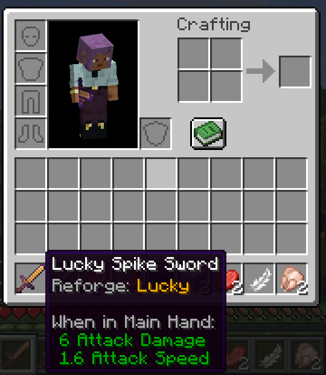
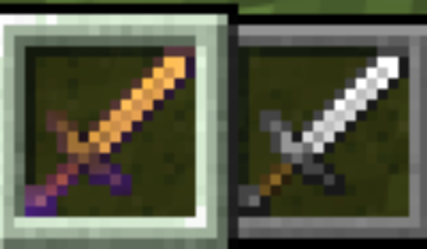
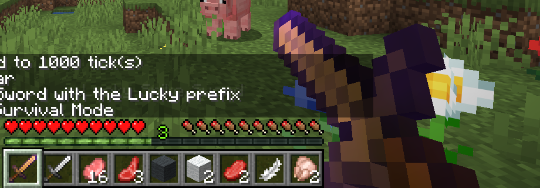

# Spike S4 — Item presentation: a reforge prefix in the name, the tooltip and the glint

Date: 2026-09-05 · Status: **answered yes on all three, without Mixins** · Code: `sb_core` (`ReforgePrefix`, `GearItem`, the tooltip appender), `sb_gear` (the module's first files: `/sb reforge`, the capture harness, a game test), kept as the seed of reforging (#23)

## Question

Reforging (PRD 3.5) puts one prefix on an item that must show in its name ("Lucky Spike Sword"), add a tooltip line and mark the item visually. Can the 26.2 item pipeline do all three from a single data component, so loot tables, the reforge transaction and saves have one source of truth, and which approach survives a resource reload and a language switch?

## What was built

| Piece | Where | Notes |
|---|---|---|
| `sb_core:reforge_prefix` data component, value `ReforgePrefix(Identifier modifier)` | `sb_core` `SbDataComponents`, `ReforgePrefix` | Persistent and network-synced; the id will point into `sb:reforge_modifier` (#23). The record implements vanilla's `TooltipProvider`, so the component describes its own tooltip line the way `enchantments` or `lore` do |
| `GearItem`, the base class of every item that can be reforged | `sb_core` `api.item.GearItem` | Overrides `getName` (prefix composed at display time through the lang key `reforge.sb_core.named` = `"%s %s"`) and `isFoil` (glints while the component is present). Nothing else: 26.2 configures swords and armor through `Item.Properties` on plain items, and that stays |
| Tooltip line placement | `sb_core` `SbCore#registerTooltipAppenders` | NeoForge 26.2's `RegisterTooltipAppendersEvent` places component appenders relative to vanilla's; ours goes before every vanilla component line, right under the item's own text |
| Item model definition reacting to the component | `sb_combat` `assets/sb_combat/items/spike_sword.json` | `minecraft:condition` with the `minecraft:has_component` property on `sb_core:reforge_prefix`, `on_true` the same model with a constant gold tint. Demonstration only: what a reforged item looks like is #23's call |
| `/sb reforge <modifier>` and `/sb reforge clear` (gamemaster) | `sb_gear` `SbGearCommands` | Writes or removes the component on the source entity's main-hand item; every module hangs its commands under `/sb` |
| `clientGear` run + `GearDebug` | `sb_gear` build.gradle, `client/GearDebug` | Joins the capture world, gives and reforges the spike sword through the real command, screenshots the held item and the inventory with the sword's tooltip, quits |
| Game test `sb_gear_tests:reforge_prefix` | `sb_gear/src/gametest` | Runs the command on a mock player, asserts the component, the name "Lucky Spike Sword", the glint, the tooltip's second line "Reforge: Lucky", and that `clear` restores the plain item |

## What happened

All three effects came from the one component:

- **Name.** `ItemStack.getHoverName()` asks the item (`Item.getName(stack)`), which by default returns the `item_name` component. `GearItem.getName` wraps that in `reforge.sb_core.named` with the prefix's name (`reforge.<namespace>.<path>`, e.g. `reforge.sb_gear.lucky` = "Lucky") first. Rarity colour and the anvil's italic rule still apply on top, because they live in `getStyledHoverName`.
- **Tooltip.** Vanilla hard-codes which components print lines; NeoForge 26.2 exposes that list through `RegisterTooltipAppendersEvent`, fired once after registries freeze. `registerComponentAppenderBeforeAll(REFORGE_PREFIX, TooltipAppender.createComponentAppender(type))` was enough; the line's text comes from `ReforgePrefix.addToTooltip`.
- **Glint.** The 26.2 item model definition has no glint field: `ItemStack.hasFoil()` decides (the `enchantment_glint_override` component, else `Item.isFoil`), and every model wrapper reads it. `GearItem.isFoil` answers true with the component. The model definition can still change the *model* on the component (`has_component` condition, or `component` with a predicate for a specific modifier), which is how a per-modifier look or a "subtle tier" overlay would be done.

The game test passes headlessly (`:sb_gear:runGameTestServer`, 4/4 with core's and combat's), and the captures above are from the `clientGear` run.

## Which approach is reload-safe

Two ways to show the prefix in the name were weighed:

| | Component-derived (chosen) | Written `item_name` component |
|---|---|---|
| Source of truth | one component | two components to keep in sync (`reforge_prefix` and `item_name`) |
| Loot tables (`set_components` pre-rolled prefixes) | set one component | set both, and repeat the item's own name inside the second |
| Language switch / lang edit / resource reload | live, composed each frame from translation keys | live for the prefix if a translatable component was stored; stale if an item's own name key ever changes |
| Renaming a modifier id | a data migration either way | same |
| Works on items we do not own | no: needs `GearItem` | yes |

Every reforgeable item is ours (weapons never mine, decision 0006; armor and accessories are our items), so the `GearItem` requirement costs nothing, and the component-derived path is the reload-safe one: the name and the line are composed from lang keys at display time and F3+T or a language change updates them instantly; nothing is baked into the stack. The written-name path stays the fallback if a future feature must decorate a vanilla item.

The glint through `isFoil` is likewise derived; `enchantment_glint_override` would be a second component to sync. Note that the override, when present, still wins (vanilla checks it first), which is the right precedence for a data pack that wants to force a look.

## Things learned that change the plan

- **NeoForge 26.2 tooltip appenders** replace the older `ItemTooltipEvent` pattern for component lines: a component that implements `TooltipProvider` plus one registration line, positioned deterministically among vanilla's. Rarity (#26) and armor set bonuses (#53) should use the same mechanism.
- **Commands share the `/sb` root** across modules; Brigadier merges literals registered separately, so `/sb reforge`, and later `/sb seal`, `/sb class`, live side by side without a central registrar.
- **The item model condition works on our component id straight from JSON**: `"property": "minecraft:has_component", "component": "sb_core:reforge_prefix"`. Per-modifier looks can use `minecraft:component` with a `DataComponentPredicate` once the modifier registry exists.
- **Programmatic cursor moves do not reach the mouse handler**, so a capture harness draws the tooltip it wants through `ScreenEvent.Render.Pre` (`setTooltipForNextFrame`); the deferred tooltip is flushed at the end of the screen's own pass, before the post-render event, and the first one queued wins.
- **`sealbreaker.mod`** (`buildSrc`) now carries the module layout every mod shares: one line per module (`sealbreakerMod.dependsOnModules ':sb_core', ':sb_combat'`) wires compilation, the run configurations' loaded mods and the game test namespaces. Adding `sb_world` and `sb_bosses` for S5, S3 and S2 is a `build.gradle` of three lines each.

## Not verified yet (needs a person at the keyboard)

- A real language switch in the options screen while holding a reforged item (the logic is translation keys end to end, and the test passes on the server's English table).
- How the gold tint and the glint read on a 16px texture drawn for the purpose; the spike used the iron sword sprite.
