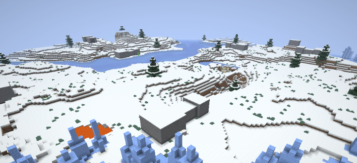
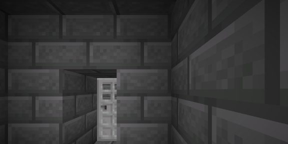
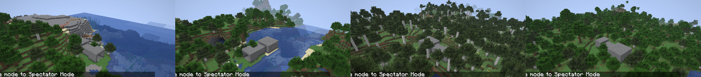

# Spike S5 — A jigsaw structure with a processor list and a locked door at a configured rarity

Date: 2026-09-05 · Status: **answered yes on all four items** · Code: `sb_world` (the module's first files: the locked door block and its key, the spike structure's data, a capture harness, two game tests), kept as the seed of structures and dungeons (#29)

## Question

The Tier 1 structure, the reforge NPC's cell and every later dungeon rest on jigsaw structures with our own blocks inside. Does the 26.2 pipeline give us, from data alone: template pools that assemble pieces, a processor list that alters them, a placement at a rarity we choose, and a custom block inside a template that keeps its block entity data (a door that only its key opens)?

## What was built

| Piece | Where | Notes |
|---|---|---|
| Three templates: entrance 7×6×5 (open porch), corridor 5×5×7, room 9×6×9 | `data/sb_world/structure/spike/*.nbt`, generated by `python tools/gen_structures.py spike` | Written by a 180-line NBT writer (`tools/nbt.py`) instead of structure blocks, so the pieces are reproducible and reviewable; jigsaw blocks sit in the floor under each doorway with `final_state` putting the floor back, so doorways line up |
| Template pools `sb_world:spike/entrance`, `corridor`, `room` | `data/sb_world/worldgen/template_pool/spike/*.json` | `single_pool_element`, `rigid`, each with the processor list; fallback `minecraft:empty` |
| Processor list `sb_world:spike_rot` | `data/sb_world/worldgen/processor_list/spike_rot.json` | `minecraft:rule` with `random_block_match` 0.2: stone bricks → cracked stone bricks |
| Structure `sb_world:spike` and structure set | `data/sb_world/worldgen/structure/spike.json`, `structure_set/spike.json` | Jigsaw type, `start_height` absolute 0 projected to `WORLD_SURFACE_WG`, `beard_thin`, size 4; `random_spread` spacing 6 / separation 2 (one attempt per 36 chunks: spike density for easy finding) |
| Biome tag `#sb_world:has_structure/spike` | `data/sb_world/tags/worldgen/biome/has_structure/spike.json` | Plains, meadows, savannas, forests, taigas, snowy plains: the first version with `#minecraft:is_overworld` put the structure in the sea |
| `sb_world:locked_door` + `LockedDoorBlockEntity` | `sb_world` `block/` | Extends vanilla `DoorBlock` (iron set type, so hands cannot open it through vanilla's path) and implements `EntityBlock` on the lower half; the block entity holds `key` (an item id) and `unlocked`. Using the key item unlocks and opens; afterwards it toggles by hand; redstone never moves it; unbreakable |
| `sb_world:spike_key` | `sb_world` `item/` | A plain item the room's door asks for; the id comes from the template's block NBT `{"key": "sb_world:spike_key"}` |
| `clientWorld` run + `WorldDebug` | `sb_world/build.gradle`, `client/WorldDebug` | Creates a fresh default world for a seed from the title screen, asks the integrated server for the nearest `sb_world:spike`, teleports to an overview, then into the corridor facing the door, screenshots both, quits |
| Game tests `sb_world_tests:locked_door_template`, `jigsaw_assembly` | `sb_world/src/gametest` | The first places the room template and works the door (no key, wrong item, key on the upper half, then by hand); the second runs `JigsawPlacement.generateJigsaw` (what `/place jigsaw` calls) on the new 48×12×48 `sb_core_tests:arena_large`, then asserts one door with its key, some but not all bricks cracked, no jigsaw blocks left, and the entrance's doorway eight blocks in front of the door |

## What happened







| Item | Answer |
|---|---|
| 1. Pools, structure, structure set place the three pieces at the configured rarity | **Yes.** Five seeds, five spawns within 64 chunks of spawn (below). Assembly is deterministic per seed and chunk (the start rotation comes from the world-gen random), which the game test copes with by searching its arena for the door |
| 2. A custom block in a template keeps its block entity data | **Yes.** `StructureTemplate.placeInWorld` calls `BlockEntity.loadWithComponents` with the template's per-block `nbt`, both through direct placement and through the jigsaw pipeline; the door's key survives both (game-tested) and the door in the seed-4 world only opens with the key |
| 3. A processor list swaps a block at a probability | **Yes.** About a fifth of the stone bricks are cracked in every capture and in the game test's count |
| 4. `/locate structure sb_world:spike` finds it | **Yes,** through the same call the command makes (`ChunkGenerator.findNearestMapStructure`), from the harness |

Seed list (default world type, structure located from spawn, all on land after the biome tag change):

| Seed | Structure start | Bounding box (with terrain-adaptation padding) |
|---|---|---|
| 1 | 208, 68, 144 | 176..220 × 50..79 × 131..163 |
| 2 | −176, 68, 16 | −195..−163 × 50..79 × −16..28 |
| 3 | −96, 73, −80 | −128..−84 × 55..84 × −93..−61 |
| 4 | −176, 76, 48 | −189..−157 × 57..86 × 36..80 (door at −173, 70, 60 facing north) |
| 5 | −96, 73, −80 | −108..−64 × 55..84 × −99..−67 |

Game tests: `:sb_world:runGameTestServer` 5/5 (core 2, combat 1, world 2).

## The 26.2 file layout (for #29)

```
data/<ns>/structure/<path>.nbt                              templates (DataVersion 4903 for 26.2)
data/<ns>/worldgen/template_pool/<path>.json                pools: elements + fallback
data/<ns>/worldgen/processor_list/<name>.json               processors
data/<ns>/worldgen/structure/<name>.json                    type minecraft:jigsaw, start_pool, biomes, step, start_height, terrain_adaptation
data/<ns>/worldgen/structure_set/<name>.json                structures + placement (random_spread: spacing, separation, salt[, frequency])
data/<ns>/tags/worldgen/biome/has_structure/<name>.json     the biome tag the structure's "biomes" field points at
```

Jigsaw block NBT keys: `name`, `target`, `pool`, `final_state`, `joint` (`rollable`/`aligned`), optional `placement_priority`, `selection_priority`. A jigsaw facing `south_up` connects to one facing `north_up` placed one block further south; the pieces are translated so the two jigsaw blocks meet, so their in-piece coordinates need not match.

## Things learned that change the plan

- **Templates as code.** `tools/gen_structures.py` (and `tools/nbt.py`) let a piece be described in a few lines and regenerated; for the hand-built pieces of the real Tier 1 structure, structure blocks in a creative world remain the way, but arenas, corridors and test rooms are cheaper in code.
- **Terrain adaptation inflates the bounding box** (12 blocks each side for `beard_thin`), which is why the located boxes are 44×29×32 for a 21×6×9 structure; `/locate` positions are the start chunk's corner, not the entrance. Any "you are inside the dungeon" test (a Seal gate, a boss room sealing) must use piece bounding boxes or a dedicated block, never the start box.
- **The game test server never generates structures** (`WorldOptions(0, false, false)`), so placement rarity cannot be game-tested; assembly can (`JigsawPlacement.generateJigsaw`), and rarity is checked with the harness on real seeds. Structure tests want the large arena.
- **Rotation is random per seed and chunk** in both real generation and `generateJigsaw`; tests search for landmark blocks instead of assuming a direction, and the door's `facing` property tells the way in.
- **A fresh run directory shows first-launch screens** (accessibility onboarding) before the title screen; harnesses that start from the title screen wait them out or copy `options.txt` from a sibling run.
- **The locked door pattern generalises:** any dungeon block with per-instance data (a boss room seal, an NPC cell with the rescue key, a shrine's Seal id) is a block entity whose data rides in the template NBT.

## Not verified yet (needs a person at the keyboard)

- Walking the structure in survival: the porch, corridor and room fit a player, but nothing checked lighting or whether the room needs a floor gap over uneven terrain (the pieces are rigid and the room can hang over a slope; the real structure needs `terrain_matching` or a foundation piece).
- The door's sounds and the "locked" feedback (chest-locked sound, chain-break on unlock) heard in game.
